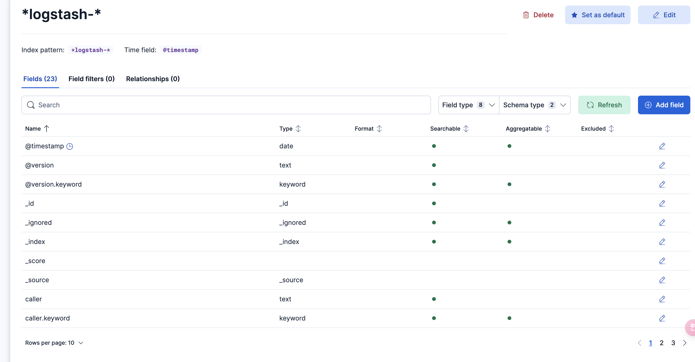

#### 项目背景

每个业务系统都有日志，当系统出现问题时，需要通过日志信息来定位和解决问题。当系统机器比较少时，登录到服务器上查看即可满足，当系统机器规模巨大，登录到机器上查看几乎不现实（分布式的系统，一个系统部署在多台机器上）

#### 解决方案

把机器上的日志实时收集，统一存储到中心系统。再对这些日志建立索引，通过搜索即可快速找到对应的日志记录。通过提供一个界面友好的 web 页面实现日志展示与检索

> 本篇文章实现基于 Zap 与 ELK 的日志实践. 通过定制化 Zap 实现多输出源，
> 同时将日志输出到 Console （Standard IO） 、file、与 redis 队列中(生成环境可以换 kafka) 中，再配置 Logstash 使其读取 queue 中的日志并写入 ES 中，最后在 Kibana 中展示。

#### 流程

1. worker 产生日志,输出到终端(可选), 日志文件, 及队列
2. logstash 作为消费者从队列中拿到日志输出到 elasticsearch
3. elasticsearch 结合 Kibana,可视化展示日志
   > 队列: 本篇文章采用的是 redis list. 生成环境不建议使用 redis list. 如果日志产生速度非常快, redis list 是比较消耗服务器 CPU,内存的.建议换成其他 MQ,比如 kafka
   > 日志写入队列方式有很多,比如: 写入终端(可选),日志文件的同时,写入队列 或者 写入到日志文件之后,通过监听日志文件,写入队列

创建 logger. 输出到 Console （Standard IO） 、日志文件、与 队列 中

```go

func NewLogger(writer *redisWriter) *zap.Logger {

	encoder := getEncoder()

	writerSyncer := getLogWriter("./logs/log.log")
	syncer := zapcore.AddSync(writer)
	redisCore := zapcore.NewCore(encoder, zapcore.AddSync(syncer), zapcore.DebugLevel)
	fileCore := zapcore.NewCore(encoder, writerSyncer, zapcore.DebugLevel)

	consoleCore := zapcore.NewCore(encoder, zapcore.AddSync(os.Stdout), zapcore.DebugLevel)
	core := zapcore.NewTee(redisCore, consoleCore, fileCore)
	return zap.New(core, zap.AddCaller())
}

func getEncoder() zapcore.Encoder {
	encoderConfig := zap.NewProductionEncoderConfig()
	encoderConfig.EncodeTime = zapcore.ISO8601TimeEncoder
	encoderConfig.EncodeLevel = zapcore.CapitalColorLevelEncoder
	return zapcore.NewConsoleEncoder(encoderConfig)
}

func getLogWriter(filepath string) zapcore.WriteSyncer {
	lumberJack := &lumberjack.Logger{
		Filename:   filepath,
		MaxSize:    20480,
		MaxBackups: 30,
		Compress:   true,
	}
	return zapcore.AddSync(lumberJack)
}

func NewRedisWriter(key string, cli *redis.Client) *redisWriter {
	return &redisWriter{
		cli: cli, listKey: key,
	}
}

type redisWriter struct {
	cli     *redis.Client
	listKey string
}

func (w *redisWriter) Write(p []byte) (int, error) {
	n, err := w.cli.RPush(w.listKey, p).Result()
	return int(n), err
}

func main() {
	cli := redis.NewClient(&redis.Options{
		Addr: "127.0.0.1:6379",
		DB:   8,
	})

	writer := NewRedisWriter("log_list", cli)
	logger := NewLogger(writer)

	logger.Info("test logger info", zap.String("ceshi info log", "logger"))
	logger.Warn("test logger info", zap.String("ceshi warn log", "logger"))
	logger.Debug("test logger info", zap.String("ceshi debug log", "logger"))
	logger.Error("test logger info", zap.String("ceshi error log", "logger"), zap.Error(errors.New("error")))
}
```

运行 go run main.go,会同时输出到终端,日志文件,及 队列中

#### 搭建 ELK 环境

```shell
git clone https://github.com/deviantony/docker-elk.git
```

修改 logstash input ，配置文件位置 docker-elk/logstash/pipeline/logstash.conf：

> redis 的 host 配置成 host.docker.internal.因为本篇文章测试的时候 redis 是运行本机电脑上的.如果你是用的 docker 跑的 redis.你需要配置 docker 里的 redis server 或者让 redis 和 logstash 用同一个 network

```markdown
input {
beats {
port => 5044
}

    tcp {
    	port => 50000
    }

    redis {
    	data_type => "list"
    	key => "log_list"
    	host => "host.docker.internal"
    	port => 6379
    	db => 8
    	threads => 2
    }

}

## Add your filters / logstash plugins configuration here

output {
stdout {
codec => rubydebug
}

    elasticsearch {
    	hosts => "http://elasticsearch:9200"
    	user => "logstash_internal"
    	password => "changeme"
    	index => "logstash-%{+YYYY.MM.dd}"  # 添加此行指定索引名称
    }

}
```

修改后启动 ELK.

```shell
docker compose up setup
docker compose up -d
```

执行 docker exec -it <container_id/container_name> /usr/share/kibana/bin/kibana-encryption-keys generate
生成之后,配置 kibana/config/kinana.yml

```markdown
xpack.encryptedSavedObjects.encryptionKey:
xpack.reporting.encryptionKey:
xpack.security.encryptionKey:
```

重启 logstash

```shell
docker restart docker-elk-logstash-1
```

访问 Kibana(http://127.0.0.1:5601).如果你没改密码,默认用户名: elastic, 密码: changeme
启动之后需要去创建 index pattern

- 打开你的浏览器，访问 http://localhost:5601
- 点击左侧导航栏的菜单按钮（左上角三条横线 ☰）打开菜单
- 找到：Stack Management（堆栈管理） ➝ 点击进入
- 在 Stack Management 页面里，点击左侧的 “Data Views”（旧版本叫 Index Patterns）
- 点击右上角 “Create data view”
- 输入你想创建的 pattern，比如 _logstash-_
- 选择时间字段（如果有，如 @timestamp），然后点击创建
- index-pattern: 和上一步 logstash 输出的索引保持一致 比如: `*logstash-*`,选择 timestamp 作为 filter
  
  

创建后回到 Discover 页面

