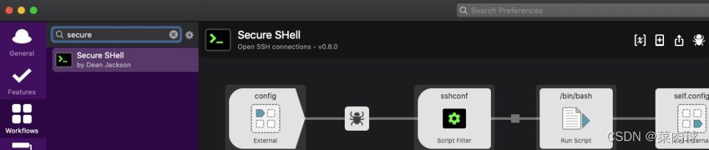
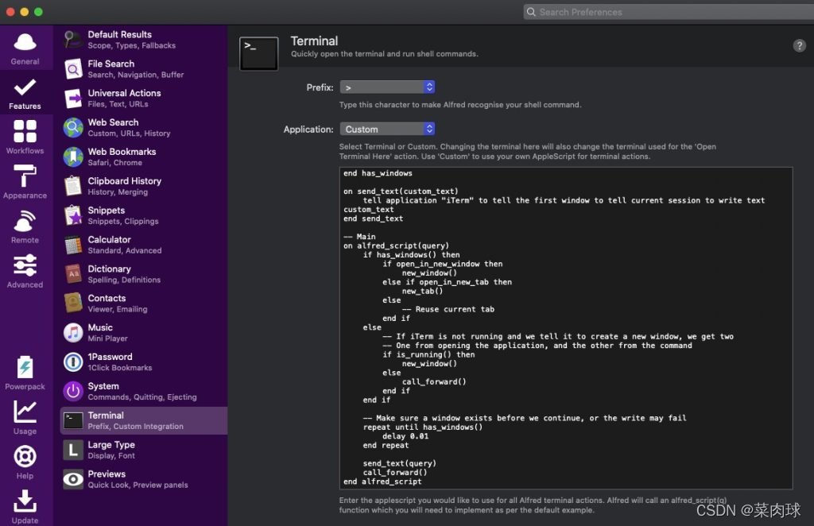
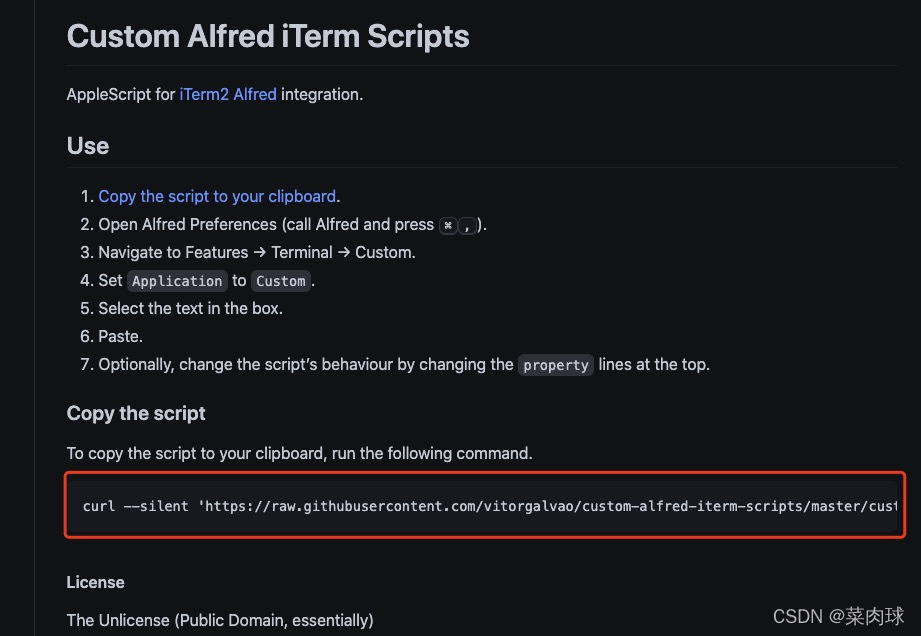
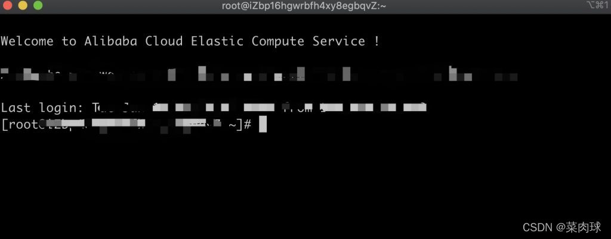

**背景**

环境：Mac

工具：

1. iterm2 网上自行下载配置
2. alfred5 官网自行下载，此教程用到 Workflows 需要购买.

作为程序猿，在实际工作中，需要经常连接各个环境的服务器查看日志等操作。每次都要打开终端输入 <span style="color:red;">ssh root@ip</span>，步骤繁琐，浪费时间

使用 alfred+iterm2+ssh，可以实现一步直达。丝滑倍爽，如下图


### ssh config

通过使用<span style="color:red;">openssh</span>的<span style="color:red;">ssh config</span>，实现密码登陆，不再需要每次打开 iterm2 输入<span style="color:red;">ssh root@ip</span>命令

打开 iterm2 终端，使用<span style="color:red;">vim ~/.ssh/config</span>命令编辑<span style="color:red;">config</span>文件

```shell
Host caixiaoxin
  HostName ip
  User root  # 用户名
  Port 22    # 默认端口 22
```

保存退出。打开 iterm2 输入<span style="color:red;">ssh caixiaoxin</span>回车，按提示输入密码。即可登陆目标服务器，省略了<span style="color:red;">ssh root@ip</span>步骤

### 免密登陆

把上一步需要通过手工在 iterm2 终端输入密码的步骤也省略掉

通过<span style="color:red;">ssh-copy-id -i</span>命令。此命令是将本机中的密钥复制的目标服务器上，授权连接。打开 iterm2 终端输入：

1. （可选）如果你电脑上没有通过<span style="color:red;">ssh</span>生成过密钥，执行此步骤，如果已存在，忽略此步骤直接执行第二步

```shell
-> ssh-keygen
```

2. 复制密钥到远程目标服务器

```shell
-> ssh-copy-id -i root@ip
# root 用户名
# ip   远程目标服务器ip
```

第一次会让你按照提示输入密码，<span style="color:red;">ssh-copy-id</span>就会把公钥 id_rsa.pub 追加到远程目标服务器的<span style="color:red;">~/.ssh/authorized_keys</span>文件中。后续通过 ssh 连接服务器不再需要输入密码

3. 打开 item，测试效果

```shell
-> ssh caixiaoxin
```

此时你会发现，一条命令即可登陆目标服务器。但是还是需要打开 iterm2 终端，继续往下走

### 安装 alfred-ssh 插件

此步骤，已经默认你在电脑上已经安装了 alfred，并且可以正常使用 Workflows

插件链接地址: <a href="https://github.com/vitorgalvao/custom-alfred-iterm-scripts" target="_blank" rel="noopener">[alfred-ssh]</a>

安装最新版即可，小编安装的<span style="color:red;">Secure-SHell-0.8.0.alfredworkflow</span>

下载下来，双击自动添加到 alfred 的 Workflows 页,如下图


此时就可以使用 alfred 来连接远程服务器了。打开 alfred 输入 ssh caixiaoxin，就可以直接连接上目标服务器进行需要的操作了。但是发现，连接上之后，终端使用的 mac 自带的，并不是 iterm2。继续走~

### 安装 alfred 集成 iterm2 配置

1. 打开 alfred 的 Features 页面, <span style="color:red;">Preferences → Features → Terminal/Shell</span>,将 Application 的值改为 Custom，如下图
   

打开<a href="https://github.com/vitorgalvao/custom-alfred-iterm-scripts" target="_blank" rel="noopener">[iTem2 plugin for Alfred]</a>，将 custom_iterm_script.applescript 文件中的代码复制到上图的输入框中。一个大牛写的 custom applescript。如下图


2. 打开 iterm2 终端，执行一下代码
   

3. 打开 iterm2 preferences → Profiles → PROFILE_NAME → General → URL Schemes， 选择 ssh。
   配置完成开始体验之旅吧

效果:


回车


## 记录几款 Alfred workflow 效率插件

地址: https://alfred.app/workflows/

1. [atop] : https://alfred.app/workflows/chrisgrieser/atop/
2. [BrowserTabs] : https://alfred.app/workflows/epilande/browser-tabs/
3. [GoToHere] : https://alfred.app/workflows/paulrudy/go-to-here/
4. [MovieAndTvShowSearch] : https://alfred.app/workflows/tmcknight/movie-and-tv-show-search/
5. [NewFile] : https://alfred.app/workflows/zeitlings/new-file/
6. [OpenInVsCode] : https://alfred.app/workflows/mayjunejuly/open-in-vs-code/
7. [StrongPassword] : https://alfred.app/workflows/vitor/strong-password/
8. [Translate] : https://alfred.app/workflows/meshchaninov/translate/
9. [WHOISLookUp] : https://alfred.app/workflows/firefingers21/whois-lookup/
