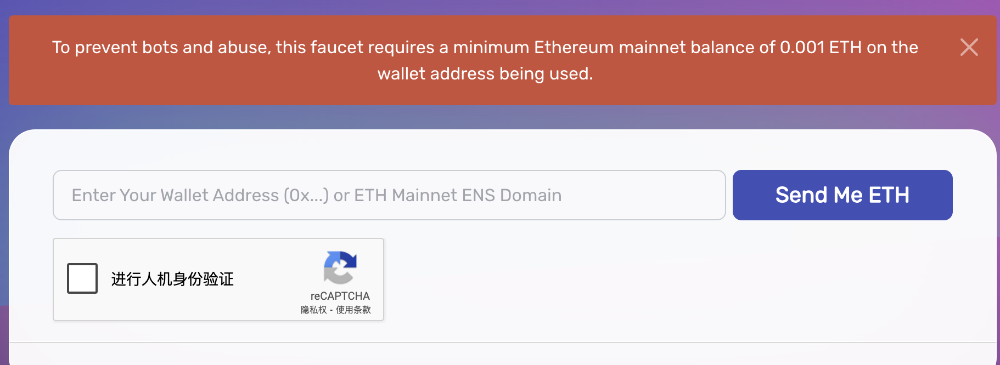
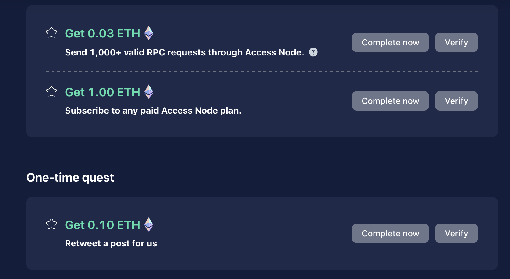
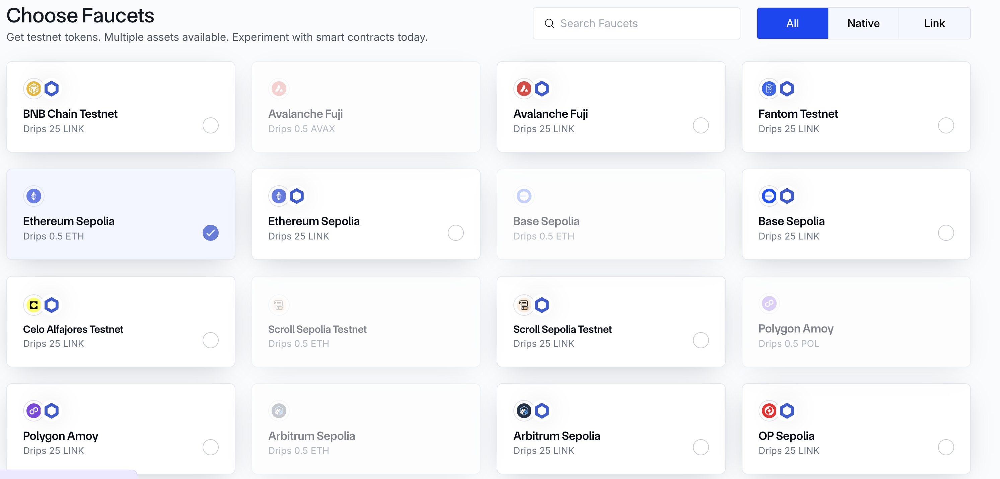
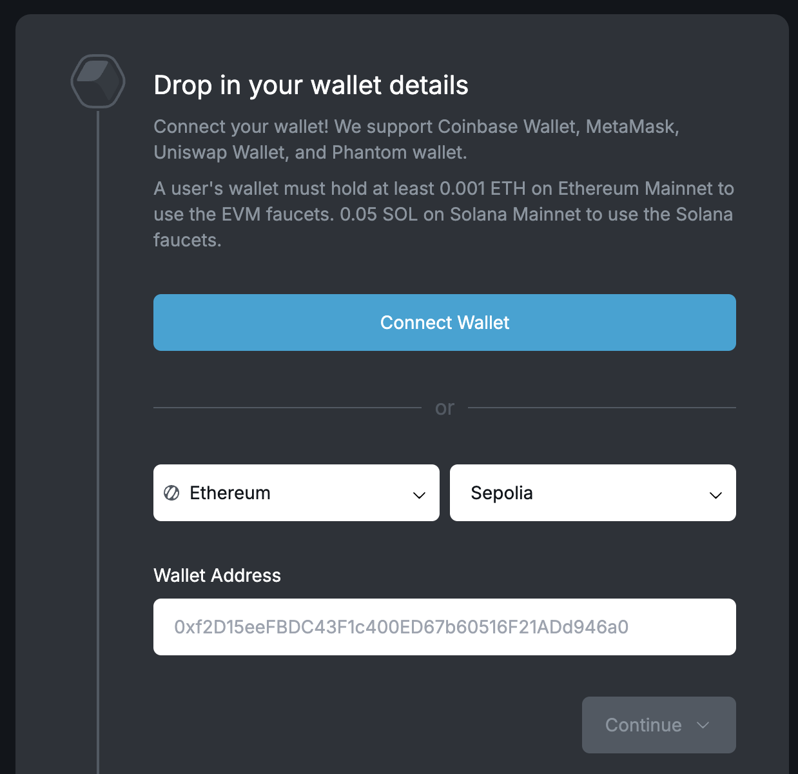
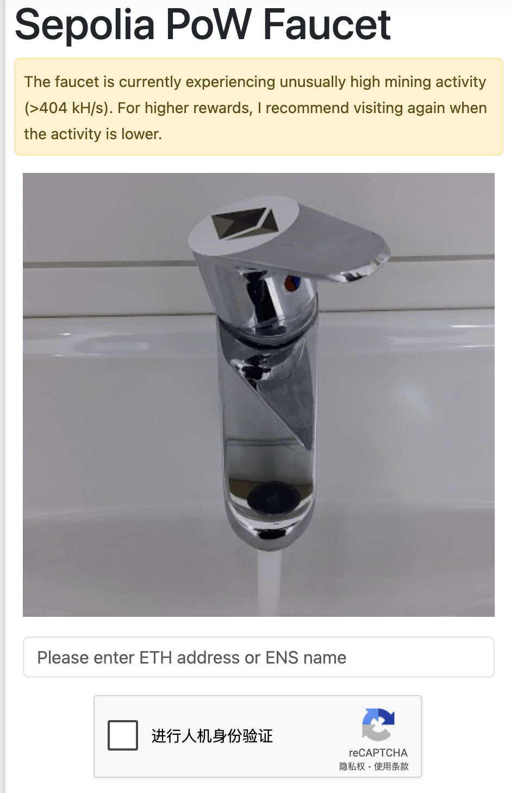
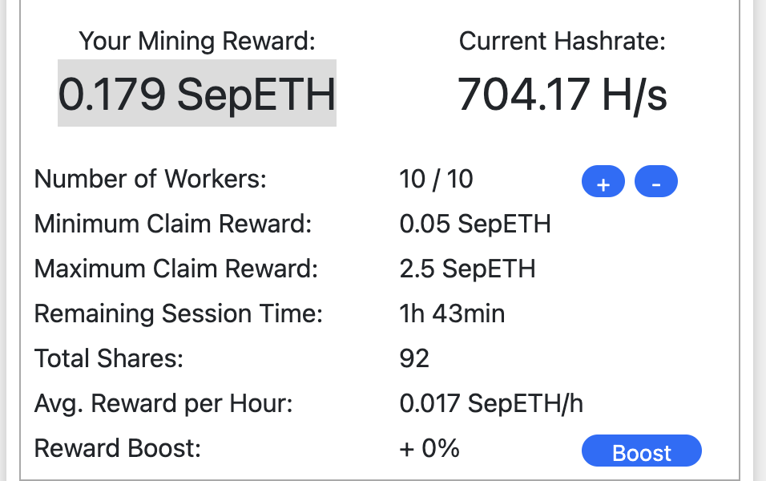

> 领取测试网ETH水.能多领点就多领点,以备以后需求

## 免费领水水龙头地址列表

### www.alchemy.com/faucets/ethereum-sepolia 

> To prevent bots and abuse, this faucet requires a minimum Ethereum mainnet balance of 0.001 ETH on the wallet address being used.
需要主网有0.001ETH,领取失败

### https://access.rockx.com/faucet-sepolia

这个我也没领成功

### https://faucets.chain.link/

> Requests for native tokens require the user to hold at least 1 LINK on Ethereum Mainnet. This restriction does not apply to requests for testnet LINK.
需要在以太坊主网上拥有一个LINK. 领取失败

### https://faucet.quicknode.com/ethereum/sepolia

> 需要在主网有0.001ETH. 要是领取SOL,需要在主网有至少0.05SOL. 领取失败

### www.infura.io/faucet/sepolia
> 领取失败

### https://faucet.trade/sepolia-eth-faucet
> 没有尝试, 不知道是否能领取成功.需要的可以试试

### https://sepolia-faucet.pk910.de/

> 领取成功.这个相当于去挖矿.挖出来的! 第一次领取1.12个SepETH. 第二次领取 0.179SepETH

## 以下是截止目前废弃的领取测试网水龙头
* https://faucet.goerli.mudit.blog/
* https://faucet.kovan.network/
* https://faucet.rinkeby.io/
* https://faucet.ropsten.be/