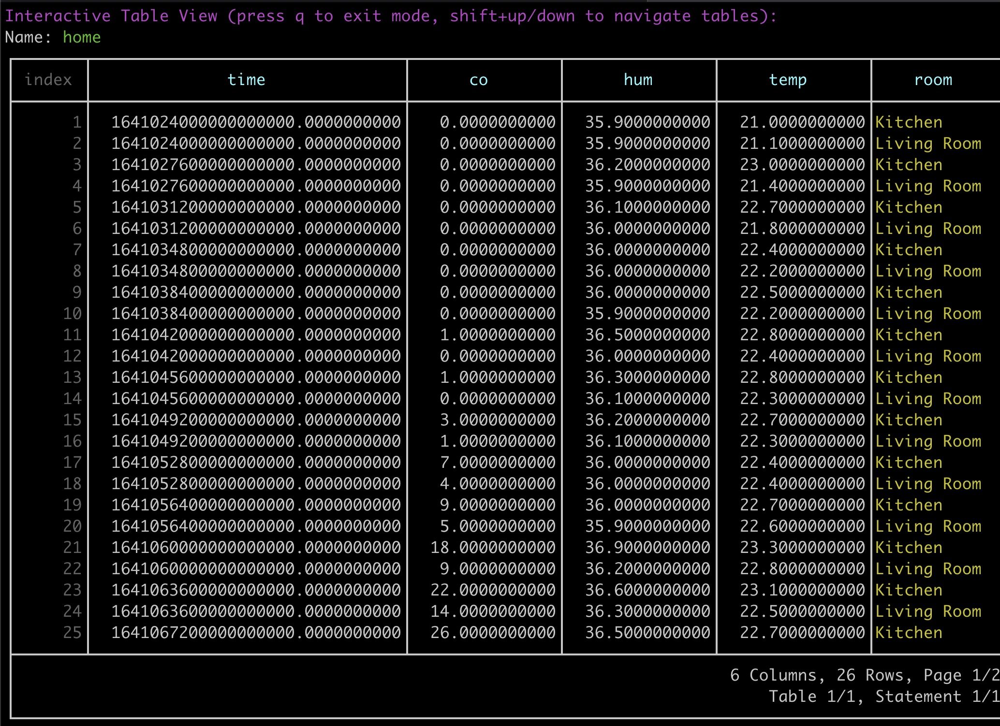

<a href="https://docs.influxdata.com/influxdb/v2/" target="_blank">以下概念及操作均来自influxdb2 官方文档</a>

InfluxDB2 is the platform purpose-built to collect, store, process and visualize time series data. Time series data is a sequence of data points indexed in time order. Data points typically consist of successive measurements made from the same source and are used to track changes over time. Examples of time series data include:

* Industrial sensor data
* Server performance metrics
* Heartbeats per minute
* Electrical activity in the brain
* Rainfall measurements
* Stock prices
  

## 使用docker安装

```bash
docker run \
 --name influxdb2 \
 --publish 8086:8086 \
 --mount type=volume,source=influxdb2-data,target=/var/lib/influxdb2 \
 --mount type=volume,source=influxdb2-config,target=/etc/influxdb2 \
 --env DOCKER_INFLUXDB_INIT_MODE=setup \
 --env DOCKER_INFLUXDB_INIT_USERNAME=ADMIN_USERNAME \
 --env DOCKER_INFLUXDB_INIT_PASSWORD=ADMIN_PASSWORD \
 --env DOCKER_INFLUXDB_INIT_ORG=ORG_NAME \
 --env DOCKER_INFLUXDB_INIT_BUCKET=BUCKET_NAME \
 influxdb:2

Example:
docker run \
 --name influxdb2 \
 --publish 8086:8086 \
 --mount type=volume,source=influxdb2-data,target=/var/lib/influxdb2 \
 --mount type=volume,source=influxdb2-config,target=/etc/influxdb2 \
 --env DOCKER_INFLUXDB_INIT_MODE=setup \
 --env DOCKER_INFLUXDB_INIT_USERNAME=influxdb \
 --env DOCKER_INFLUXDB_INIT_PASSWORD=influxdb \
 --env DOCKER_INFLUXDB_INIT_ORG=influxdb \
 --env DOCKER_INFLUXDB_INIT_BUCKET=influxdb \
 influxdb:2
```

- --publish 8086:8086: Exposes the InfluxDB UI and HTTP API on the host’s 8086 port.
- --mount type=volume,source=influxdb2-data,target=/var/lib/influxdb2: Creates a volume named influxdb2-data mapped to the InfluxDB data directory to persist data outside the container.
- `--mount type=volume,source=influxdb2-config,target=/etc/influxdb2`: Creates a volume named `influxdb2-config` mapped to the [InfluxDB configuration directory](https://docs.influxdata.com/influxdb/v2/reference/internals/file-system-layout/?t=docker#file-system-layout) to make configurations available outside the container.
- `--env DOCKER_INFLUXDB_INIT_MODE=setup`: Environment variable that invokes the automated setup of the initial organization, user, bucket, and token when creating the container.
- `--env DOCKER_INFLUXDB_INIT_<SETUP_OPTION>`: Environment variables for initial setup options–replace the following with your own values:
  - - `ADMIN_USERNAME`: The username for the initial [user](https://docs.influxdata.com/influxdb/v2/admin/users/)–an admin user with an API [Operator token](https://docs.influxdata.com/influxdb/v2/admin/tokens/#operator-token).
    - `ADMIN_PASSWORD`: The password for the initial [user](https://docs.influxdata.com/influxdb/v2/admin/users/).
    - `ORG_NAME`: The name for the initial [organization](https://docs.influxdata.com/influxdb/v2/admin/organizations/).
    - `BUCKET_NAME`: The name for the initial [bucket](https://docs.influxdata.com/influxdb/v2/admin/buckets/).

If successful, the command starts InfluxDB initialized with the user, organization, bucket, and *[Operator token](https://docs.influxdata.com/influxdb/v2/admin/tokens/#operator-token)*, and logs to stdout.

You can view the Operator token in the `/etc/influxdb2/influx-configs` file and use it to authorize [creating an All Access token](https://docs.influxdata.com/influxdb/v2/install/?t=Docker#optional-create-all-access-tokens).

访问: http://127.0.0.1:8086/


## 操作 CLI

### write

- `-b, --bucket` or `--bucket-id` flag with the bucket name or ID to write do.
- `-p, --precision` flag with the timestamp precision (`s`).
- String-encoded line protocol.

```bash
influx write \
  --bucket influxdb \
  --precision s "
home,room=Living\ Room temp=21.1,hum=35.9,co=0i 1641024000
home,room=Kitchen temp=21.0,hum=35.9,co=0i 1641024000
home,room=Living\ Room temp=21.4,hum=35.9,co=0i 1641027600
home,room=Kitchen temp=23.0,hum=36.2,co=0i 1641027600
home,room=Living\ Room temp=21.8,hum=36.0,co=0i 1641031200
home,room=Kitchen temp=22.7,hum=36.1,co=0i 1641031200
home,room=Living\ Room temp=22.2,hum=36.0,co=0i 1641034800
home,room=Kitchen temp=22.4,hum=36.0,co=0i 1641034800
home,room=Living\ Room temp=22.2,hum=35.9,co=0i 1641038400
home,room=Kitchen temp=22.5,hum=36.0,co=0i 1641038400
home,room=Living\ Room temp=22.4,hum=36.0,co=0i 1641042000
home,room=Kitchen temp=22.8,hum=36.5,co=1i 1641042000
home,room=Living\ Room temp=22.3,hum=36.1,co=0i 1641045600
home,room=Kitchen temp=22.8,hum=36.3,co=1i 1641045600
home,room=Living\ Room temp=22.3,hum=36.1,co=1i 1641049200
home,room=Kitchen temp=22.7,hum=36.2,co=3i 1641049200
home,room=Living\ Room temp=22.4,hum=36.0,co=4i 1641052800
home,room=Kitchen temp=22.4,hum=36.0,co=7i 1641052800
home,room=Living\ Room temp=22.6,hum=35.9,co=5i 1641056400
home,room=Kitchen temp=22.7,hum=36.0,co=9i 1641056400
home,room=Living\ Room temp=22.8,hum=36.2,co=9i 1641060000
home,room=Kitchen temp=23.3,hum=36.9,co=18i 1641060000
home,room=Living\ Room temp=22.5,hum=36.3,co=14i 1641063600
home,room=Kitchen temp=23.1,hum=36.6,co=22i 1641063600
home,room=Living\ Room temp=22.2,hum=36.4,co=17i 1641067200
home,room=Kitchen temp=22.7,hum=36.5,co=26i 1641067200
"
```


### Query

```bash
root@c2ecea1e4729:/# influx query '
from(bucket: "influxdb")
    |> range(start: 2022-01-01T08:00:00Z, stop: 2022-01-01T20:00:01Z)
    |> filter(fn: (r) => r._measurement == "home")
    |> filter(fn: (r) => r._field== "co" or r._field == "hum" or r._field == "temp")
'
```

结果

```bash
Result: _result
Table: keys: [_start, _stop, _field, _measurement, room]
                   _start:time                      _stop:time           _field:string     _measurement:string             room:string                      _time:time                  _value:int
------------------------------  ------------------------------  ----------------------  ----------------------  ----------------------  ------------------------------  --------------------------
2022-01-01T08:00:00.000000000Z  2022-01-01T20:00:01.000000000Z                      co                    home                 Kitchen  2022-01-01T08:00:00.000000000Z                           0
2022-01-01T08:00:00.000000000Z  2022-01-01T20:00:01.000000000Z                      co                    home                 Kitchen  2022-01-01T09:00:00.000000000Z                           0
2022-01-01T08:00:00.000000000Z  2022-01-01T20:00:01.000000000Z                      co                    home                 Kitchen  2022-01-01T10:00:00.000000000Z                           0
2022-01-01T08:00:00.000000000Z  2022-01-01T20:00:01.000000000Z                      co                    home                 Kitchen  2022-01-01T11:00:00.000000000Z                           0
2022-01-01T08:00:00.000000000Z  2022-01-01T20:00:01.000000000Z                      co                    home                 Kitchen  2022-01-01T12:00:00.000000000Z                           0
2022-01-01T08:00:00.000000000Z  2022-01-01T20:00:01.000000000Z                      co                    home                 Kitchen  2022-01-01T13:00:00.000000000Z                           1
2022-01-01T08:00:00.000000000Z  2022-01-01T20:00:01.000000000Z                      co                    home                 Kitchen  2022-01-01T14:00:00.000000000Z                           1
2022-01-01T08:00:00.000000000Z  2022-01-01T20:00:01.000000000Z                      co                    home                 Kitchen  2022-01-01T15:00:00.000000000Z                           3
2022-01-01T08:00:00.000000000Z  2022-01-01T20:00:01.000000000Z                      co                    home                 Kitchen  2022-01-01T16:00:00.000000000Z                           7
2022-01-01T08:00:00.000000000Z  2022-01-01T20:00:01.000000000Z                      co                    home                 Kitchen  2022-01-01T17:00:00.000000000Z                           9
2022-01-01T08:00:00.000000000Z  2022-01-01T20:00:01.000000000Z                      co                    home                 Kitchen  2022-01-01T18:00:00.000000000Z                          18
2022-01-01T08:00:00.000000000Z  2022-01-01T20:00:01.000000000Z                      co                    home                 Kitchen  2022-01-01T19:00:00.000000000Z                          22
2022-01-01T08:00:00.000000000Z  2022-01-01T20:00:01.000000000Z                      co                    home                 Kitchen  2022-01-01T20:00:00.000000000Z                          26
Table: keys: [_start, _stop, _field, _measurement, room]
                   _start:time                      _stop:time           _field:string     _measurement:string             room:string                      _time:time                  _value:float
------------------------------  ------------------------------  ----------------------  ----------------------  ----------------------  ------------------------------  ----------------------------
2022-01-01T08:00:00.000000000Z  2022-01-01T20:00:01.000000000Z                     hum                    home                 Kitchen  2022-01-01T08:00:00.000000000Z                          35.9
2022-01-01T08:00:00.000000000Z  2022-01-01T20:00:01.000000000Z                     hum                    home                 Kitchen  2022-01-01T09:00:00.000000000Z                          36.2
2022-01-01T08:00:00.000000000Z  2022-01-01T20:00:01.000000000Z                     hum                    home                 Kitchen  2022-01-01T10:00:00.000000000Z                          36.1
2022-01-01T08:00:00.000000000Z  2022-01-01T20:00:01.000000000Z                     hum                    home                 Kitchen  2022-01-01T11:00:00.000000000Z                            36
2022-01-01T08:00:00.000000000Z  2022-01-01T20:00:01.000000000Z                     hum                    home                 Kitchen  2022-01-01T12:00:00.000000000Z                            36
2022-01-01T08:00:00.000000000Z  2022-01-01T20:00:01.000000000Z                     hum                    home                 Kitchen  2022-01-01T13:00:00.000000000Z                          36.5
2022-01-01T08:00:00.000000000Z  2022-01-01T20:00:01.000000000Z                     hum                    home                 Kitchen  2022-01-01T14:00:00.000000000Z                          36.3
2022-01-01T08:00:00.000000000Z  2022-01-01T20:00:01.000000000Z                     hum                    home                 Kitchen  2022-01-01T15:00:00.000000000Z                          36.2
2022-01-01T08:00:00.000000000Z  2022-01-01T20:00:01.000000000Z                     hum                    home                 Kitchen  2022-01-01T16:00:00.000000000Z                            36
2022-01-01T08:00:00.000000000Z  2022-01-01T20:00:01.000000000Z                     hum                    home                 Kitchen  2022-01-01T17:00:00.000000000Z                            36
2022-01-01T08:00:00.000000000Z  2022-01-01T20:00:01.000000000Z                     hum                    home                 Kitchen  2022-01-01T18:00:00.000000000Z                          36.9
2022-01-01T08:00:00.000000000Z  2022-01-01T20:00:01.000000000Z                     hum                    home                 Kitchen  2022-01-01T19:00:00.000000000Z                          36.6
2022-01-01T08:00:00.000000000Z  2022-01-01T20:00:01.000000000Z                     hum                    home                 Kitchen  2022-01-01T20:00:00.000000000Z                          36.5
Table: keys: [_start, _stop, _field, _measurement, room]
                   _start:time                      _stop:time           _field:string     _measurement:string             room:string                      _time:time                  _value:float
------------------------------  ------------------------------  ----------------------  ----------------------  ----------------------  ------------------------------  ----------------------------
2022-01-01T08:00:00.000000000Z  2022-01-01T20:00:01.000000000Z                    temp                    home                 Kitchen  2022-01-01T08:00:00.000000000Z                            21
2022-01-01T08:00:00.000000000Z  2022-01-01T20:00:01.000000000Z                    temp                    home                 Kitchen  2022-01-01T09:00:00.000000000Z                            23
2022-01-01T08:00:00.000000000Z  2022-01-01T20:00:01.000000000Z                    temp                    home                 Kitchen  2022-01-01T10:00:00.000000000Z                          22.7
2022-01-01T08:00:00.000000000Z  2022-01-01T20:00:01.000000000Z                    temp                    home                 Kitchen  2022-01-01T11:00:00.000000000Z                          22.4
2022-01-01T08:00:00.000000000Z  2022-01-01T20:00:01.000000000Z                    temp                    home                 Kitchen  2022-01-01T12:00:00.000000000Z                          22.5
2022-01-01T08:00:00.000000000Z  2022-01-01T20:00:01.000000000Z                    temp                    home                 Kitchen  2022-01-01T13:00:00.000000000Z                          22.8
2022-01-01T08:00:00.000000000Z  2022-01-01T20:00:01.000000000Z                    temp                    home                 Kitchen  2022-01-01T14:00:00.000000000Z                          22.8
2022-01-01T08:00:00.000000000Z  2022-01-01T20:00:01.000000000Z                    temp                    home                 Kitchen  2022-01-01T15:00:00.000000000Z                          22.7
2022-01-01T08:00:00.000000000Z  2022-01-01T20:00:01.000000000Z                    temp                    home                 Kitchen  2022-01-01T16:00:00.000000000Z                          22.4
2022-01-01T08:00:00.000000000Z  2022-01-01T20:00:01.000000000Z                    temp                    home                 Kitchen  2022-01-01T17:00:00.000000000Z                          22.7
2022-01-01T08:00:00.000000000Z  2022-01-01T20:00:01.000000000Z                    temp                    home                 Kitchen  2022-01-01T18:00:00.000000000Z                          23.3
2022-01-01T08:00:00.000000000Z  2022-01-01T20:00:01.000000000Z                    temp                    home                 Kitchen  2022-01-01T19:00:00.000000000Z                          23.1
2022-01-01T08:00:00.000000000Z  2022-01-01T20:00:01.000000000Z                    temp                    home                 Kitchen  2022-01-01T20:00:00.000000000Z                          22.7
Table: keys: [_start, _stop, _field, _measurement, room]
                   _start:time                      _stop:time           _field:string     _measurement:string             room:string                      _time:time                  _value:int
------------------------------  ------------------------------  ----------------------  ----------------------  ----------------------  ------------------------------  --------------------------
2022-01-01T08:00:00.000000000Z  2022-01-01T20:00:01.000000000Z                      co                    home             Living Room  2022-01-01T08:00:00.000000000Z                           0
2022-01-01T08:00:00.000000000Z  2022-01-01T20:00:01.000000000Z                      co                    home             Living Room  2022-01-01T09:00:00.000000000Z                           0
2022-01-01T08:00:00.000000000Z  2022-01-01T20:00:01.000000000Z                      co                    home             Living Room  2022-01-01T10:00:00.000000000Z                           0
2022-01-01T08:00:00.000000000Z  2022-01-01T20:00:01.000000000Z                      co                    home             Living Room  2022-01-01T11:00:00.000000000Z                           0
2022-01-01T08:00:00.000000000Z  2022-01-01T20:00:01.000000000Z                      co                    home             Living Room  2022-01-01T12:00:00.000000000Z                           0
2022-01-01T08:00:00.000000000Z  2022-01-01T20:00:01.000000000Z                      co                    home             Living Room  2022-01-01T13:00:00.000000000Z                           0
2022-01-01T08:00:00.000000000Z  2022-01-01T20:00:01.000000000Z                      co                    home             Living Room  2022-01-01T14:00:00.000000000Z                           0
2022-01-01T08:00:00.000000000Z  2022-01-01T20:00:01.000000000Z                      co                    home             Living Room  2022-01-01T15:00:00.000000000Z                           1
2022-01-01T08:00:00.000000000Z  2022-01-01T20:00:01.000000000Z                      co                    home             Living Room  2022-01-01T16:00:00.000000000Z                           4
2022-01-01T08:00:00.000000000Z  2022-01-01T20:00:01.000000000Z                      co                    home             Living Room  2022-01-01T17:00:00.000000000Z                           5
2022-01-01T08:00:00.000000000Z  2022-01-01T20:00:01.000000000Z                      co                    home             Living Room  2022-01-01T18:00:00.000000000Z                           9
2022-01-01T08:00:00.000000000Z  2022-01-01T20:00:01.000000000Z                      co                    home             Living Room  2022-01-01T19:00:00.000000000Z                          14
2022-01-01T08:00:00.000000000Z  2022-01-01T20:00:01.000000000Z                      co                    home             Living Room  2022-01-01T20:00:00.000000000Z                          17
Table: keys: [_start, _stop, _field, _measurement, room]
                   _start:time                      _stop:time           _field:string     _measurement:string             room:string                      _time:time                  _value:float
------------------------------  ------------------------------  ----------------------  ----------------------  ----------------------  ------------------------------  ----------------------------
2022-01-01T08:00:00.000000000Z  2022-01-01T20:00:01.000000000Z                     hum                    home             Living Room  2022-01-01T08:00:00.000000000Z                          35.9
2022-01-01T08:00:00.000000000Z  2022-01-01T20:00:01.000000000Z                     hum                    home             Living Room  2022-01-01T09:00:00.000000000Z                          35.9
2022-01-01T08:00:00.000000000Z  2022-01-01T20:00:01.000000000Z                     hum                    home             Living Room  2022-01-01T10:00:00.000000000Z                            36
2022-01-01T08:00:00.000000000Z  2022-01-01T20:00:01.000000000Z                     hum                    home             Living Room  2022-01-01T11:00:00.000000000Z                            36
2022-01-01T08:00:00.000000000Z  2022-01-01T20:00:01.000000000Z                     hum                    home             Living Room  2022-01-01T12:00:00.000000000Z                          35.9
2022-01-01T08:00:00.000000000Z  2022-01-01T20:00:01.000000000Z                     hum                    home             Living Room  2022-01-01T13:00:00.000000000Z                            36
2022-01-01T08:00:00.000000000Z  2022-01-01T20:00:01.000000000Z                     hum                    home             Living Room  2022-01-01T14:00:00.000000000Z                          36.1
2022-01-01T08:00:00.000000000Z  2022-01-01T20:00:01.000000000Z                     hum                    home             Living Room  2022-01-01T15:00:00.000000000Z                          36.1
2022-01-01T08:00:00.000000000Z  2022-01-01T20:00:01.000000000Z                     hum                    home             Living Room  2022-01-01T16:00:00.000000000Z                            36
2022-01-01T08:00:00.000000000Z  2022-01-01T20:00:01.000000000Z                     hum                    home             Living Room  2022-01-01T17:00:00.000000000Z                          35.9
2022-01-01T08:00:00.000000000Z  2022-01-01T20:00:01.000000000Z                     hum                    home             Living Room  2022-01-01T18:00:00.000000000Z                          36.2
2022-01-01T08:00:00.000000000Z  2022-01-01T20:00:01.000000000Z                     hum                    home             Living Room  2022-01-01T19:00:00.000000000Z                          36.3
2022-01-01T08:00:00.000000000Z  2022-01-01T20:00:01.000000000Z                     hum                    home             Living Room  2022-01-01T20:00:00.000000000Z                          36.4
Table: keys: [_start, _stop, _field, _measurement, room]
                   _start:time                      _stop:time           _field:string     _measurement:string             room:string                      _time:time                  _value:float
------------------------------  ------------------------------  ----------------------  ----------------------  ----------------------  ------------------------------  ----------------------------
2022-01-01T08:00:00.000000000Z  2022-01-01T20:00:01.000000000Z                    temp                    home             Living Room  2022-01-01T08:00:00.000000000Z                          21.1
2022-01-01T08:00:00.000000000Z  2022-01-01T20:00:01.000000000Z                    temp                    home             Living Room  2022-01-01T09:00:00.000000000Z                          21.4
2022-01-01T08:00:00.000000000Z  2022-01-01T20:00:01.000000000Z                    temp                    home             Living Room  2022-01-01T10:00:00.000000000Z                          21.8
2022-01-01T08:00:00.000000000Z  2022-01-01T20:00:01.000000000Z                    temp                    home             Living Room  2022-01-01T11:00:00.000000000Z                          22.2
2022-01-01T08:00:00.000000000Z  2022-01-01T20:00:01.000000000Z                    temp                    home             Living Room  2022-01-01T12:00:00.000000000Z                          22.2
2022-01-01T08:00:00.000000000Z  2022-01-01T20:00:01.000000000Z                    temp                    home             Living Room  2022-01-01T13:00:00.000000000Z                          22.4
2022-01-01T08:00:00.000000000Z  2022-01-01T20:00:01.000000000Z                    temp                    home             Living Room  2022-01-01T14:00:00.000000000Z                          22.3
2022-01-01T08:00:00.000000000Z  2022-01-01T20:00:01.000000000Z                    temp                    home             Living Room  2022-01-01T15:00:00.000000000Z                          22.3
2022-01-01T08:00:00.000000000Z  2022-01-01T20:00:01.000000000Z                    temp                    home             Living Room  2022-01-01T16:00:00.000000000Z                          22.4
2022-01-01T08:00:00.000000000Z  2022-01-01T20:00:01.000000000Z                    temp                    home             Living Room  2022-01-01T17:00:00.000000000Z                          22.6
2022-01-01T08:00:00.000000000Z  2022-01-01T20:00:01.000000000Z                    temp                    home             Living Room  2022-01-01T18:00:00.000000000Z                          22.8
2022-01-01T08:00:00.000000000Z  2022-01-01T20:00:01.000000000Z                    temp                    home             Living Room  2022-01-01T19:00:00.000000000Z                          22.5
2022-01-01T08:00:00.000000000Z  2022-01-01T20:00:01.000000000Z                    temp                    home             Living Room  2022-01-01T20:00:00.000000000Z                          22.2
```


### influxQL  query

```bash
root@c2ecea1e4729:/# influx v1 shell
```

```bash
SELECT co,hum,temp,room FROM "influxdb".autogen.home WHERE time >= '2022-01-01T08:00:00Z' AND time <= '2022-01-01T20:00:00Z'
```

结果:




## 在数据中重新映射或赋值
使用map（）函数迭代数据中的每一行，并更新该行中的值。map（）是Flux中最有用的函数之一，将帮助您完成许多需要执行的数据处理操作。

```bash
influx query 'from(bucket: "influxdb")
    |> range(start: 2022-01-01T08:00:00Z, stop: 2022-01-01T20:00:01Z)
    |> filter(fn: (r) => r._measurement == "home")
    |> filter(fn: (r) => r._field == "hum")
    |> map(fn: (r) => ({r with _value: r._value / 100.0}))
'
```

### 分组数据
使用group（）函数按特定列值重新组合数据，为进一步处理做准备。

```bash
influx query 'from(bucket: "influxdb")
    |> range(start: 2022-01-01T08:00:00Z, stop: 2022-01-01T20:00:01Z)
    |> filter(fn: (r) => r._measurement == "home")
    |> group(columns: ["room", "_field"])
'
```

### Aggregate or select specific data

Use Flux [aggregate](https://docs.influxdata.com/flux/v0/function-types/#aggregates) or [selector](https://docs.influxdata.com/flux/v0/function-types/#selectors) functions to return aggregate or selected values from **each** input table.

mean（）返回每个输入表中指定列中非空值的平均值。

```bash
influx query 'from(bucket: "influxdb")
    |> range(start: 2022-01-01T08:00:00Z, stop: 2022-01-01T20:00:01Z)
    |> filter(fn: (r) => r._measurement == "home")
    |> filter(fn: (r) => r._field == "co" or r._field == "hum" or r._field == "temp")
    |> mean()
'
```

```bash
root@c2ecea1e4729:/# influx query 'from(bucket: "influxdb")
    |> range(start: 2022-01-01T08:00:00Z, stop: 2022-01-01T20:00:01Z)
    |> filter(fn: (r) => r._measurement == "home")
    |> filter(fn: (r) => r._field == "co" or r._field == "hum" or r._field == "temp")
    |> mean()
'
Result: _result
Table: keys: [_start, _stop, _field, _measurement, room]
                   _start:time                      _stop:time           _field:string     _measurement:string             room:string                  _value:float
------------------------------  ------------------------------  ----------------------  ----------------------  ----------------------  ----------------------------
2022-01-01T08:00:00.000000000Z  2022-01-01T20:00:01.000000000Z                      co                    home                 Kitchen            6.6923076923076925
Table: keys: [_start, _stop, _field, _measurement, room]
                   _start:time                      _stop:time           _field:string     _measurement:string             room:string                  _value:float
------------------------------  ------------------------------  ----------------------  ----------------------  ----------------------  ----------------------------
2022-01-01T08:00:00.000000000Z  2022-01-01T20:00:01.000000000Z                     hum                    home                 Kitchen            36.246153846153845
Table: keys: [_start, _stop, _field, _measurement, room]
                   _start:time                      _stop:time           _field:string     _measurement:string             room:string                  _value:float
------------------------------  ------------------------------  ----------------------  ----------------------  ----------------------  ----------------------------
2022-01-01T08:00:00.000000000Z  2022-01-01T20:00:01.000000000Z                    temp                    home                 Kitchen            22.623076923076926
Table: keys: [_start, _stop, _field, _measurement, room]
                   _start:time                      _stop:time           _field:string     _measurement:string             room:string                  _value:float
------------------------------  ------------------------------  ----------------------  ----------------------  ----------------------  ----------------------------
2022-01-01T08:00:00.000000000Z  2022-01-01T20:00:01.000000000Z                      co                    home             Living Room            3.8461538461538463
Table: keys: [_start, _stop, _field, _measurement, room]
                   _start:time                      _stop:time           _field:string     _measurement:string             room:string                  _value:float
------------------------------  ------------------------------  ----------------------  ----------------------  ----------------------  ----------------------------
2022-01-01T08:00:00.000000000Z  2022-01-01T20:00:01.000000000Z                     hum                    home             Living Room             36.05384615384615
Table: keys: [_start, _stop, _field, _measurement, room]
                   _start:time                      _stop:time           _field:string     _measurement:string             room:string                  _value:float
------------------------------  ------------------------------  ----------------------  ----------------------  ----------------------  ----------------------------
2022-01-01T08:00:00.000000000Z  2022-01-01T20:00:01.000000000Z                    temp                    home             Living Room             22.16923076923077
```


### Aggregate functions

[Aggregate functions](https://docs.influxdata.com/flux/v0/function-types/#aggregates) drop columns that are **not** in the [group key](https://docs.influxdata.com/flux/v0/get-started/data-model/#group-key) and return a single row for each input table with the aggregate value of that table.

```bash
influx query 'from(bucket: "influxdb")
    |> range(start: 2022-01-01T14:00:00Z, stop: 2022-01-01T20:00:01Z)
    |> filter(fn: (r) => r._measurement == "home")
    |> filter(fn: (r) => r._field == "temp")
    |> mean()
    |> duplicate(column: "_stop", as: "_time")
'
```

```bash
root@c2ecea1e4729:/# influx query 'from(bucket: "influxdb")
    |> range(start: 2022-01-01T14:00:00Z, stop: 2022-01-01T20:00:01Z)
    |> filter(fn: (r) => r._measurement == "home")
    |> filter(fn: (r) => r._field == "temp")
    |> mean()
    |> duplicate(column: "_stop", as: "_time")
'
Result: _result
Table: keys: [_start, _stop, _field, _measurement, room]
                   _start:time                      _stop:time           _field:string     _measurement:string             room:string                  _value:float                      _time:time
------------------------------  ------------------------------  ----------------------  ----------------------  ----------------------  ----------------------------  ------------------------------
2022-01-01T14:00:00.000000000Z  2022-01-01T20:00:01.000000000Z                    temp                    home                 Kitchen            22.814285714285713  2022-01-01T20:00:01.000000000Z
Table: keys: [_start, _stop, _field, _measurement, room]
                   _start:time                      _stop:time           _field:string     _measurement:string             room:string                  _value:float                      _time:time
------------------------------  ------------------------------  ----------------------  ----------------------  ----------------------  ----------------------------  ------------------------------
2022-01-01T14:00:00.000000000Z  2022-01-01T20:00:01.000000000Z                    temp                    home             Living Room             22.44285714285714  2022-01-01T20:00:01.000000000Z
```


### 将数据转换为关系模式
如果来自关系SQL或类SQL查询语言，如InfluxQL，Flux使用的数据模型与您习惯的不同。Flux返回多个表，每个表包含一个不同的字段。“关系”模式将每个字段构造为每行中的一列。
使用pivot（）函数根据时间戳将数据转换为“关系”模式。

```bash
influx query 'from(bucket: "influxdb")
    |> range(start: 2022-01-01T14:00:00Z, stop: 2022-01-01T20:00:01Z)
    |> filter(fn: (r) => r._measurement == "home")
    |> filter(fn: (r) => r._field == "co" or r._field == "hum" or r._field == "temp")
    |> filter(fn: (r) => r.room == "Kitchen")
    |> pivot(rowKey: ["_time"], columnKey: ["_field"], valueColumn: "_value")
'
```

```bash
root@c2ecea1e4729:/# influx query 'from(bucket: "influxdb")
    |> range(start: 2022-01-01T14:00:00Z, stop: 2022-01-01T20:00:01Z)
    |> filter(fn: (r) => r._measurement == "home")
    |> filter(fn: (r) => r._field == "co" or r._field == "hum" or r._field == "temp")
    |> filter(fn: (r) => r.room == "Kitchen")
    |> pivot(rowKey: ["_time"], columnKey: ["_field"], valueColumn: "_value")
'
Result: _result
Table: keys: [_start, _stop, _measurement, room]
                   _start:time                      _stop:time     _measurement:string             room:string                      _time:time                      co:int                     hum:float                    temp:float
------------------------------  ------------------------------  ----------------------  ----------------------  ------------------------------  --------------------------  ----------------------------  ----------------------------
2022-01-01T14:00:00.000000000Z  2022-01-01T20:00:01.000000000Z                    home                 Kitchen  2022-01-01T14:00:00.000000000Z                           1                          36.3                          22.8
2022-01-01T14:00:00.000000000Z  2022-01-01T20:00:01.000000000Z                    home                 Kitchen  2022-01-01T15:00:00.000000000Z                           3                          36.2                          22.7
2022-01-01T14:00:00.000000000Z  2022-01-01T20:00:01.000000000Z                    home                 Kitchen  2022-01-01T16:00:00.000000000Z                           7                            36                          22.4
2022-01-01T14:00:00.000000000Z  2022-01-01T20:00:01.000000000Z                    home                 Kitchen  2022-01-01T17:00:00.000000000Z                           9                            36                          22.7
2022-01-01T14:00:00.000000000Z  2022-01-01T20:00:01.000000000Z                    home                 Kitchen  2022-01-01T18:00:00.000000000Z                          18                          36.9                          23.3
2022-01-01T14:00:00.000000000Z  2022-01-01T20:00:01.000000000Z                    home                 Kitchen  2022-01-01T19:00:00.000000000Z                          22                          36.6                          23.1
2022-01-01T14:00:00.000000000Z  2022-01-01T20:00:01.000000000Z                    home                 Kitchen  2022-01-01T20:00:00.000000000Z                          26                          36.5                          22.7
```


### 数据下采样
数据下采样是一种提高查询性能并优化长期数据存储的策略。简而言之，下采样可以减少查询返回的点数，而不会丢失数据的总体趋势。

有关数据下采样的更多信息，请参阅数据下采样。

最常见的数据下采样方法是按时间间隔或“窗口”。例如，您可能希望查询过去一小时的数据，并返回每五分钟窗口的平均值。

使用aggregateWindow()按指定的时间间隔对数据进行下采样：

* 使用 every 参数指定每个窗口的持续时间。

* 使用 fn 参数指定要应用于每个窗口的聚合函数或选择器函数。
* （可选）使用 timeSrc 参数指定要使用哪个列值来为每个窗口创建新的聚合时间戳。默认值为 _stop。

```bash
influx query 'from(bucket: "influxdb")
    |> range(start: 2022-01-01T14:00:00Z, stop: 2022-01-01T20:00:01Z)
    |> filter(fn: (r) => r._measurement == "home")
    |> filter(fn: (r) => r._field == "temp")
    |> aggregateWindow(every: 2h, fn: mean)
'
```

```bash
root@c2ecea1e4729:/# influx query 'from(bucket: "influxdb")
    |> range(start: 2022-01-01T14:00:00Z, stop: 2022-01-01T20:00:01Z)
    |> filter(fn: (r) => r._measurement == "home")
    |> filter(fn: (r) => r._field == "temp")
    |> aggregateWindow(every: 2h, fn: mean)
'
Result: _result
Table: keys: [_start, _stop, _field, _measurement, room]
                   _start:time                      _stop:time           _field:string     _measurement:string             room:string                      _time:time                  _value:float
------------------------------  ------------------------------  ----------------------  ----------------------  ----------------------  ------------------------------  ----------------------------
2022-01-01T14:00:00.000000000Z  2022-01-01T20:00:01.000000000Z                    temp                    home                 Kitchen  2022-01-01T16:00:00.000000000Z                         22.75
2022-01-01T14:00:00.000000000Z  2022-01-01T20:00:01.000000000Z                    temp                    home                 Kitchen  2022-01-01T18:00:00.000000000Z            22.549999999999997
2022-01-01T14:00:00.000000000Z  2022-01-01T20:00:01.000000000Z                    temp                    home                 Kitchen  2022-01-01T20:00:00.000000000Z            23.200000000000003
2022-01-01T14:00:00.000000000Z  2022-01-01T20:00:01.000000000Z                    temp                    home                 Kitchen  2022-01-01T20:00:01.000000000Z                          22.7
Table: keys: [_start, _stop, _field, _measurement, room]
                   _start:time                      _stop:time           _field:string     _measurement:string             room:string                      _time:time                  _value:float
------------------------------  ------------------------------  ----------------------  ----------------------  ----------------------  ------------------------------  ----------------------------
2022-01-01T14:00:00.000000000Z  2022-01-01T20:00:01.000000000Z                    temp                    home             Living Room  2022-01-01T16:00:00.000000000Z                          22.3
2022-01-01T14:00:00.000000000Z  2022-01-01T20:00:01.000000000Z                    temp                    home             Living Room  2022-01-01T18:00:00.000000000Z                          22.5
2022-01-01T14:00:00.000000000Z  2022-01-01T20:00:01.000000000Z                    temp                    home             Living Room  2022-01-01T20:00:00.000000000Z                         22.65
2022-01-01T14:00:00.000000000Z  2022-01-01T20:00:01.000000000Z                    temp                    home             Living Room  2022-01-01T20:00:01.000000000Z                          22.2
```


### Automate processing with InfluxDB tasks

[InfluxDB tasks](https://docs.influxdata.com/influxdb/v2/process-data/get-started/) are scheduled queries that can perform any of the data processing operations described above. Generally tasks then use the [`to()` function](https://docs.influxdata.com/flux/v0/stdlib/influxdata/influxdb/to/) to write the processed result back to InfluxDB.

*For more information about creating and configuring tasks, see [Get started with InfluxDB tasks](https://docs.influxdata.com/influxdb/v2/process-data/get-started/).*


## Go操作Influxdb2

<a href="https://github.com/mazezen/examples/tree/master/influxdb_go_client" target="_blank"> 完整代码</a>

### 安装依赖

First, you need to create a new go module. Run the commands below in your terminal.

```bash
mkdir -p influxdb_go_client
cd influxdb_go_client
go mod init influxdb_go_client
touch main.go
```

```bash
go get github.com/influxdata/influxdb-client-go/v2
```


### 获取Token

InfluxDB Cloud使用令牌来验证API访问。我们已为此设置过程为您创建了一个全访问令牌。

```bash
LVbJ5lreeauQy8QpILuBoTrqArti8hTRtrQDSG4_xoQefYIPl9yqJFYBt03a2kO5GNgcgKU0diYIMnEnJCVsYg==
```


### 初始化客户端

```go
package main

import influxdb2 "github.com/influxdata/influxdb-client-go/v2"

const (
	TOKEN = "LVbJ5lreeauQy8QpILuBoTrqArti8hTRtrQDSG4_xoQefYIPl9yqJFYBt03a2kO5GNgcgKU0diYIMnEnJCVsYg=="
	url = "http://127.0.0.1:8086"
)
func main() {
	client := influxdb2.NewClient(url, TOKEN)
	defer client.Close()
}
```


### 写入数据

```go

func main() {
	client := influxdb2.NewClient(url, TOKEN)
	defer client.Close()
	org := "influxdb"
	bucket := "influxdb"
	writeAPI := client.WriteAPIBlocking(org, bucket)
	for value := 0; value < 5; value++ {
		tags := map[string]string{
			"tagname1": "tagvalue1",
		}
		fields := map[string]interface{}{
			"field1": value,
		}
		point := write.NewPoint("measurement1", tags, fields, time.Now())
		time.Sleep(1 * time.Second)

		if err := writeAPI.WritePoint(context.Background(), point); err != nil {
			log.Fatal(err)
		}
	}	
}
```


### 执行简单查询

```bash
influx query 'from(bucket: "influxdb")
  |> range(start: -10m)
'
```

```go
 	org := "influxdb"

 	queryAPI := client.QueryAPI(org)
 	query := `from(bucket: "influxdb")
             |> range(start: -10m)
             |> filter(fn: (r) => r._measurement == "measurement1")`
 	results, err := queryAPI.Query(context.Background(), query)
 	if err != nil {
 		log.Fatal(err)
 	}
 	for results.Next() {
 		fmt.Println(results.Record())
 	}
 	if err := results.Err(); err != nil {
 		log.Fatal(err)
 	}
```


### 执行汇总查询

```go
	org := "influxdb"
	queryAPI := client.QueryAPI(org)
	query := `from(bucket: "influxdb")
              |> range(start: -10m)
              |> filter(fn: (r) => r._measurement == "measurement1")
              |> mean()`
	results, err := queryAPI.Query(context.Background(), query)
	if err != nil {
		log.Fatal(err)
	}
	for results.Next() {
		fmt.Println(results.Record())
	}

	if err := results.Err(); err != nil {
		log.Fatal(err)
	}
```


## Node操作Influxdb2

<a href="https://github.com/mazezen/examples/tree/master/influxdb_node_client" target="_blank"> 完整代码</a>

### 安装依赖

First, you need to create a new go module. Run the commands below in your terminal.

```bash
mkdir -p influxdb_node_client
cd influxdb_go_client
```

```bash
npm install --save @influxdata/influxdb-client
```


### 获取Token

InfluxDB Cloud使用令牌来验证API访问。我们已为此设置过程为您创建了一个全访问令牌。

```bash
LVbJ5lreeauQy8QpILuBoTrqArti8hTRtrQDSG4_xoQefYIPl9yqJFYBt03a2kO5GNgcgKU0diYIMnEnJCVsYg==
```


### 初始化客户端
