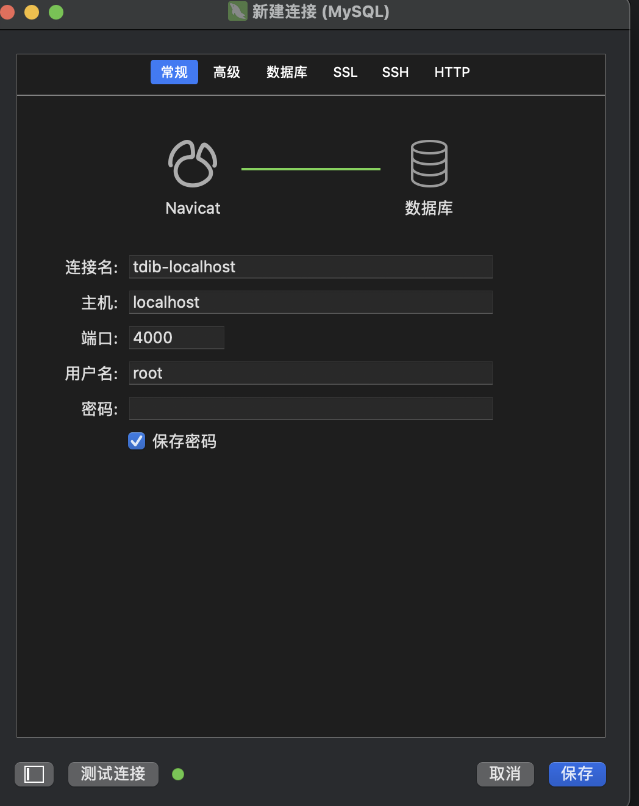

**以下内容均来自**<a href="pingcpp.com" target="_blank">TIDB 官网</a>. 如有不清楚,请自行查阅官方文档.

## 1. 简介

<a href="https://www.pingcap.com/" target="_blank">TIDB</a>

TiDB 是一个开源分布式 SQL 数据库，支持混合事务和分析处理 (HTAP) 工作负载。它兼容 MySQL，并具有水平可扩展性、强一致性和高可用性

## 2. 安装

<a href="https://docs.pingcap.com/tidb/stable/quick-start-with-tidb/#deploy-a-local-test-cluster" target="_blank">安装教程</a>

> curl --proto '=https' --tlsv1.2 -sSf https://tiup-mirrors.pingcap.com/install.sh | sh

> source ~/.zshrc

执行 `tiup`命令查看是否安装成功

```shell
TiUP is a command-line component management tool that can help to download and install
TiDB platform components to the local system. You can run a specific version of a component via
"tiup <component>[:version]". If no version number is specified, the latest version installed
locally will be used. If the specified component does not have any version installed locally,
the latest stable version will be downloaded from the repository.

Usage:
  tiup [flags] <command> [args...]
  tiup [flags] <component> [args...]
  tiup [command]

Examples:
  $ tiup playground                    # Quick start
  $ tiup playground nightly            # Start a playground with the latest nightly version
  $ tiup install <component>[:version] # Install a component of specific version
  $ tiup update --all                  # Update all installed components to the latest version
  $ tiup update --nightly              # Update all installed components to the nightly version
  $ tiup update --self                 # Update the "tiup" to the latest version
  $ tiup list                          # Fetch the latest supported components list
  $ tiup status                        # Display all running/terminated instances
  $ tiup clean <name>                  # Clean the data of running/terminated instance (Kill process if it's running)
  $ tiup clean --all                   # Clean the data of all running/terminated instances

```

- To start a TiDB cluster of the latest version with 1 TiDB instance, 1 TiKV instance, 1 PD instance, and 1 TiFlash instance, run the following command:

  (要使用 1 个 TiDB 实例、1 个 TiKV 实例、1 个人数据实例和 1 个 TiFlash 实例启动最新版本的 TiDB 集群，请运行以下命令：)

```shell
tiup playground
```

If this is the first time you run the command, TiUP will download the latest version of TiDB and start the cluster.

The output displays a list of endpoints of the cluster:

(执行`tiup playground`第一次运行,TIUP 将下载最新的版本,显示如下:)

```shell
🎉 TiDB Playground Cluster is started, enjoy!

Connect TiDB:    mysql --comments --host 127.0.0.1 --port 4000 -u root
TiDB Dashboard:  http://127.0.0.1:2379/dashboard
Grafana:         http://127.0.0.1:3000
```

- Prometheus: [http://127.0.0.1:9090](http://127.0.0.1:9090/).
- [TiDB Dashboard](https://docs.pingcap.com/tidb/stable/dashboard-intro/): http://127.0.0.1:2379/dashboard. The default username is `root`, and the password is empty.
- Grafana: [http://127.0.0.1:3000](http://127.0.0.1:3000/). Both the default username and password are `admin`.

* To specify the TiDB version and the number of instances of each component, run a command like this:

  (指定 TIDB 的版本和每个组件的示例数命令:)

```shell
tiup playground v8.5.2 --db 2 --pd 3 --kv 3
```

It is recommended to run this command on a machine with at least 10 GiB of memory and 4 CPU cores. Insufficient resources might cause the system to crash.

(建议在至少有 10 GiB 内存和 4 个 CPU 核的计算机上运行此命令。否则会出现资源不足导致系统崩溃)

To view all available versions, run` tiup list tidb`.

(查看所有支持的版本)

## 3. 客户端连接

**使用**Navicat permium



**Start a new session to access the TiDB cluster endpoints:**

- Connect to the TiDB database:

  - Use the TiUP client to connect to TiDB.

    ```shell
    tiup client
    ```

  - Alternatively, you can use the MySQL client to connect to TiDB.

    ```sh
    mysql --host 127.0.0.1 --port 4000 -u root
    ```

## 4. Clean up the cluster after testing:

1. Stop the above TiDB service by pressing Control+C.。

2. Run the following command after the service is stopped:
   服务停止后运行以下命令：

   ```sh
   tiup clean --all
   ```

## 5. 安装 集群如上。<a href="https://docs.pingcap.com/tidb/stable/quick-start-with-tidb/#deploy-a-local-test-cluster" targer="_blank">安装集群教程</a>

## 6. 执行 SQL 语句

TiDB 兼容 MySQL，大部分情况下可以直接使用 MySQL 语句。暂不支持的功能请参见 [MySQL 兼容性 ](https://docs.pingcap.com/tidb/stable/mysql-compatibility/#unsupported-features)。

### 1. 查看 | 创建 | 删除数据库

```shell
CREATE DATABASE IF NOT EXISTS samp_db;
SHOW DATABASES;
DROP DATABASE samp_db;
```

### 2. 选择数据库

```shell
use samp_db;
```

### 3. 创建 | 查看 | 删除表

```shell
CREATE TABLE person (
    id INT,
    name VARCHAR(255),
    birthday DATE
    );


SHOW CREATE table person;
SHOW TABLES;

DROM TABLE person;
```

### 4. 新建 | 显示 | 删除索引

#### 4.1 新建普通索引

```shell
CREATE INDEX person_id ON person (id);

OR

ALTER TABLE person ADD INDEX person_id (id);
```

#### 4.2 新建唯一索引

```shell
CREATE UNIQUE INDEX person_unique_id ON person (id);

OR

ALTER TABLE person ADD UNIQUE person_unique_id (id);
```

#### 4.3 查看索引

```shell
SHOW INDEX FROM person;
```

#### 4.4 删除索引

```shell
DROP INDEX person_id ON person;

OR

ALTER TABLE person DROP INDEX person_unique_id;
```

### 5. Insert | Update | Delete

```shell
INSERT INTO person VALUES(1,'tom','20170912');

INSERT INTO person(id,name) VALUES('2','bob');

UPDATE person SET birthday='20180808' WHERE id=2;

DELETE FROM person WHERE id=2;
```

### 6. Query

```shell
SELECT * FROM person;
```

### 7. 创建、授权和删除用户

- 创建一个 tiuser 的用户,密码为`123456`

```shell
CREATE USER 'tiuser'@'localhost' IDENTIFIED BY '123456';
```

- 给`tiuser`授权

```shell
GRANT SELECT ON samp_db.* TO 'tiuser'@'localhost';
```

- 查看用户的权限

```shell
SHOW GRANTS for tiuser@localhost;
```

- 删除指定用户

```shell
DROP USER 'tiuser'@'localhost';
```

## 7. Go

```go
	dsn := fmt.Sprintf(`%s:%s@tcp(%s:%s)/%s?charset=utf8mb4&tls=%s`, "root", "", "127.0.0.1", "4000", "samp_db", "false")
	// fmt.Println(dsn)
	db, err := sql.Open("mysql", dsn)
	if err != nil {
		panic(err)
	}
	defer db.Close()

	// insert
	res, err :=  db.Exec("INSERT INTO person(id, name, birthday) VALUES (3,'jke','20170912')")
	if err != nil {
		log.Fatalf("exec insert sql error: %s", err.Error())
	}
	lid, _ := res.LastInsertId()
	rid, _ := res.RowsAffected()
	fmt.Printf("insert sucessfully, last insert into id: %d\n", lid)
	fmt.Printf("insert sucessfully, RowsAffected: %d\n", rid)


	// query
	sSql := "SELECT id, name, birthday FROM person WHERE id = ?"
	rows, err := db.Query(sSql, 1)
	if err != nil {
		log.Fatalf("query data err: %s\n", err.Error())
	}
	defer rows.Close()

	id, name, birthday := 0, "", ""
	if rows.Next() {
		err = rows.Scan(&id, &name, &birthday)
		if err == nil {
			fmt.Printf("person id: %d, name: %s, bithday: %s\n", id, name, birthday)
		}
	}

	// update
	uSql := "UPDATE person set name = ? WHERE id = ?"
	_, err = db.Exec(uSql, "bike", 1)
	if err != nil {
		log.Fatalf("update data err: %s\n", err.Error())
	}
	fmt.Println("update successfully")


	// delete
	dSql := "DELETE FROM person WHERE id = ?"
	_, err = db.Exec(dSql, 1)
	if err != nil {
		log.Fatalf("delete data err: %s\n", err.Error())
	}
	fmt.Println("delete successfully")

```

## 8. Node.js

> 使用的 mysql.js, 其他的如 node-mysql2, Prisma 等查看代码仓库

```js
const mysql = require("mysql");

const options = {
  host: "127.0.1",
  port: 4000,
  user: "root",
  password: "",
  database: "samp_db",
  ssl: false,
};

const db = mysql.createConnection(options);

// insert
const date = new Date().toISOString().slice(0, 19).replace("T", " ");
db.query(
  "INSERT INTO person (id, name, birthday) VALUES (?, ?);",
  [4, "100", date],
  (err, ok) => {
    if (err) {
      console.error(err);
    } else {
      console.log(ok.insertId);
    }
  }
);

// select
db.query(
  "SELECT id, name, birthday FROM person WHERE id = 2;",
  [1],
  (err, rows) => {
    if (err) {
      console.err(err);
    } else {
      console.log(rows[0]);
    }
  }
);

// update
db.query("UPDATE person SET name = ? WHERE id = ?;", ["bob2", 2], (err, ok) => {
  if (err) {
    console.log(err);
  } else {
    console.log(ok.affectedRows);
  }
});

// delete
db.query("DELETE FROM person WHERE id = ?", [5], (err, ok) => {
  if (err) {
    console.log(err);
  } else {
    console.log(ok.affectedRows);
  }
});

db.end();
```

## Java JDBC

```java
/**
 * @author BiteMaker
 * @date 2025/7/16
 */
public class PlayerDAO {
    private final MysqlDataSource ds;
    private final Random rand = new Random();

    PlayerDAO(MysqlDataSource ds) {
        this.ds = ds;
    }

    /**
     * Recreate the table named 'player'.
     */
    public void recreateTable() {
        try (Connection connection = ds.getConnection()) {
            connection.prepareStatement("DROP TABLE IF EXISTS player").execute();
            connection.prepareStatement("CREATE TABLE player (id VARCHAR(255) PRIMARY KEY, coins INT, goods INT)").execute();
        } catch (SQLException e) {
            System.out.printf("PlayerDAO ERROR: { state => %s, cause => %s, message => %s }\n",
                    e.getSQLState(), e.getCause(), e.getMessage());
        }
    }

    /**
     * Create players by passing in a List of PlayerBean.
     *
     * @param players Will create players list
     * @return The number of create accounts
     */
    public int createPlayers(List<PlayerBean> players){
        int rows = 0;

        Connection connection = null;
        PreparedStatement preparedStatement = null;
        try {
            connection = ds.getConnection();
            preparedStatement = connection.prepareStatement("INSERT INTO player (id, coins, goods) VALUES (?, ?, ?)");
        } catch (SQLException e) {
            System.out.printf("[createPlayers] ERROR: { state => %s, cause => %s, message => %s }\n",
                    e.getSQLState(), e.getCause(), e.getMessage());
            e.printStackTrace();

            return -1;
        }

        try {
            for (PlayerBean player : players) {
                preparedStatement.setString(1, player.getId());
                preparedStatement.setInt(2, player.getCoins());
                preparedStatement.setInt(3, player.getGoods());

                preparedStatement.execute();
                rows += preparedStatement.getUpdateCount();
            }
        } catch (SQLException e) {
            System.out.printf("[createPlayers] ERROR: { state => %s, cause => %s, message => %s }\n",
                    e.getSQLState(), e.getCause(), e.getMessage());
            e.printStackTrace();
        } finally {
            try {
                connection.close();
            } catch (SQLException e) {
                e.printStackTrace();
            }
        }

        System.out.printf("\n[createPlayers]:\n    '%s'\n", preparedStatement);
        return rows;
    }

    /**
     * Buy goods and transfer funds between one player and another in one transaction.
     * @param sellId Sell player id.
     * @param buyId Buy player id.
     * @param amount Goods amount, if sell player has not enough goods, the trade will break.
     * @param price Price should pay, if buy player has not enough coins, the trade will break.
     *
     * @return The number of effected players.
     */
    public int buyGoods(String sellId, String buyId, Integer amount, Integer price) {
        int effectPlayers = 0;

        Connection connection = null;
        try {
            connection = ds.getConnection();
        } catch (SQLException e) {
            System.out.printf("[buyGoods] ERROR: { state => %s, cause => %s, message => %s }\n",
                    e.getSQLState(), e.getCause(), e.getMessage());
            e.printStackTrace();
            return effectPlayers;
        }

        try {
            connection.setAutoCommit(false);

            PreparedStatement playerQuery = connection.prepareStatement("SELECT * FROM player WHERE id=? OR id=? FOR UPDATE");
            playerQuery.setString(1, sellId);
            playerQuery.setString(2, buyId);
            playerQuery.execute();

            PlayerBean sellPlayer = null;
            PlayerBean buyPlayer = null;

            ResultSet playerQueryResultSet = playerQuery.getResultSet();
            while (playerQueryResultSet.next()) {
                PlayerBean player =  new PlayerBean(
                        playerQueryResultSet.getString("id"),
                        playerQueryResultSet.getInt("coins"),
                        playerQueryResultSet.getInt("goods")
                );

                System.out.println("\n[buyGoods]:\n    'check goods and coins enough'");
                System.out.println(player);

                if (sellId.equals(player.getId())) {
                    sellPlayer = player;
                } else {
                    buyPlayer = player;
                }
            }

            if (sellPlayer == null || buyPlayer == null) {
                throw new SQLException("player not exist.");
            }

            if (sellPlayer.getGoods().compareTo(amount) < 0) {
                throw new SQLException(String.format("sell player %s goods not enough.", sellId));
            }

            if (buyPlayer.getCoins().compareTo(price) < 0) {
                throw new SQLException(String.format("buy player %s coins not enough.", buyId));
            }

            PreparedStatement transfer = connection.prepareStatement("UPDATE player set goods = goods + ?, coins = coins + ? WHERE id=?");
            transfer.setInt(1, -amount);
            transfer.setInt(2, price);
            transfer.setString(3, sellId);
            transfer.execute();
            effectPlayers += transfer.getUpdateCount();

            transfer.setInt(1, amount);
            transfer.setInt(2, -price);
            transfer.setString(3, buyId);
            transfer.execute();
            effectPlayers += transfer.getUpdateCount();

            connection.commit();

            System.out.println("\n[buyGoods]:\n    'trade success'");
        } catch (SQLException e) {
            System.out.printf("[buyGoods] ERROR: { state => %s, cause => %s, message => %s }\n",
                    e.getSQLState(), e.getCause(), e.getMessage());

            try {
                System.out.println("[buyGoods] Rollback");

                connection.rollback();
            } catch (SQLException ex) {
                // do nothing
            }
        } finally {
            try {
                connection.close();
            } catch (SQLException e) {
                // do nothing
            }
        }

        return effectPlayers;
    }

    /**
     * Get the player info by id.
     *
     * @param id Player id.
     * @return The player of this id.
     */
    public PlayerBean getPlayer(String id) {
        PlayerBean player = null;

        try (Connection connection = ds.getConnection()) {
            PreparedStatement preparedStatement = connection.prepareStatement("SELECT * FROM player WHERE id = ?");
            preparedStatement.setString(1, id);
            preparedStatement.execute();

            ResultSet res = preparedStatement.executeQuery();
            if(!res.next()) {
                System.out.printf("No players in the table with id %s", id);
            } else {
                player = new PlayerBean(res.getString("id"), res.getInt("coins"), res.getInt("goods"));
            }
        } catch (SQLException e) {
            System.out.printf("PlayerDAO.getPlayer ERROR: { state => %s, cause => %s, message => %s }\n",
                    e.getSQLState(), e.getCause(), e.getMessage());
        }

        return player;
    }

    /**
     * Insert randomized account data (id, coins, goods) using the JDBC fast path for
     * bulk inserts.  The fastest way to get data into TiDB is using the
     * TiDB Lightning(https://docs.pingcap.com/tidb/stable/tidb-lightning-overview).
     * However, if you must bulk insert from the application using INSERT SQL, the best
     * option is the method shown here. It will require the following:
     *
     *    Add `rewriteBatchedStatements=true` to your JDBC connection settings.
     *    Setting rewriteBatchedStatements to true now causes CallableStatements
     *    with batched arguments to be re-written in the form "CALL (...); CALL (...); ..."
     *    to send the batch in as few client/server round trips as possible.
     *    https://dev.mysql.com/doc/relnotes/connector-j/5.1/en/news-5-1-3.html
     *
     *    You can see the `rewriteBatchedStatements` param effect logic at
     *    implement function: `com.mysql.cj.jdbc.StatementImpl.executeBatchUsingMultiQueries`
     *
     * @param total Add players amount.
     * @param batchSize Bulk insert size for per batch.
     *
     * @return The number of new accounts inserted.
     */
    public int bulkInsertRandomPlayers(Integer total, Integer batchSize) {
        int totalNewPlayers = 0;

        try (Connection connection = ds.getConnection()) {
            // We're managing the commit lifecycle ourselves, so we can
            // control the size of our batch inserts.
            connection.setAutoCommit(false);

            // In this example we are adding 500 rows to the database,
            // but it could be any number.  What's important is that
            // the batch size is 128.
            try (PreparedStatement pstmt = connection.prepareStatement("INSERT INTO player (id, coins, goods) VALUES (?, ?, ?)")) {
                for (int i=0; i<=(total/batchSize);i++) {
                    for (int j=0; j<batchSize; j++) {
                        String id = UUID.randomUUID().toString();
                        pstmt.setString(1, id);
                        pstmt.setInt(2, rand.nextInt(10000));
                        pstmt.setInt(3, rand.nextInt(10000));
                        pstmt.addBatch();
                    }

                    int[] count = pstmt.executeBatch();
                    totalNewPlayers += count.length;
                    System.out.printf("\nPlayerDAO.bulkInsertRandomPlayers:\n    '%s'\n", pstmt);
                    System.out.printf("    => %s row(s) updated in this batch\n", count.length);
                }
                connection.commit();
            } catch (SQLException e) {
                System.out.printf("PlayerDAO.bulkInsertRandomPlayers ERROR: { state => %s, cause => %s, message => %s }\n",
                        e.getSQLState(), e.getCause(), e.getMessage());
            }
        } catch (SQLException e) {
            System.out.printf("PlayerDAO.bulkInsertRandomPlayers ERROR: { state => %s, cause => %s, message => %s }\n",
                    e.getSQLState(), e.getCause(), e.getMessage());
        }
        return totalNewPlayers;
    }


    /**
     * Print a subset of players from the data store by limit.
     *
     * @param limit Print max size.
     */
    public void printPlayers(Integer limit) {
        try (Connection connection = ds.getConnection()) {
            PreparedStatement preparedStatement = connection.prepareStatement("SELECT * FROM player LIMIT ?");
            preparedStatement.setInt(1, limit);
            preparedStatement.execute();

            ResultSet res = preparedStatement.executeQuery();
            while (!res.next()) {
                PlayerBean player = new PlayerBean(res.getString("id"),
                        res.getInt("coins"), res.getInt("goods"));
                System.out.println("\n[printPlayers]:\n" + player);
            }
        } catch (SQLException e) {
            System.out.printf("PlayerDAO.printPlayers ERROR: { state => %s, cause => %s, message => %s }\n",
                    e.getSQLState(), e.getCause(), e.getMessage());
        }
    }


    /**
     * Count players from the data store.
     *
     * @return All players count
     */
    public int countPlayers() {
        int count = 0;

        try (Connection connection = ds.getConnection()) {
            PreparedStatement preparedStatement = connection.prepareStatement("SELECT count(*) FROM player");
            preparedStatement.execute();

            ResultSet res = preparedStatement.executeQuery();
            if(res.next()) {
                count = res.getInt(1);
            }
        } catch (SQLException e) {
            System.out.printf("PlayerDAO.countPlayers ERROR: { state => %s, cause => %s, message => %s }\n",
                    e.getSQLState(), e.getCause(), e.getMessage());
        }

        return count;
    }
}
```

## Python

```python

def get_mysqlclient_connection(autocommit: bool = True) -> pymysql.Connection:
    config = Config()
    db_conf = {
        "host": config.tidb_host,
        "port": config.tidb_port,
        "user": config.tidb_user,
        "password": config.tidb_password,
        "database": config.tidb_db_name,
        "autocommit": autocommit,
    }

    if config.ca_path:
        db_conf["ssl_mode"] = "VERIFY_IDENTITY"
        db_conf["ssl"] = {"ca": config.ca_path}
    return pymysql.connect(**db_conf)

def create_player(cursor: Cursor, player: tuple) -> None:
    cursor.execute("INSERT INTO player_py (id, coins, goods) VALUES (%s, %s, %s)", player)

def get_player(cursor: Cursor, player_id: str) -> tuple:
    cursor.execute("SELECT id, coins, goods FROM player_py WHERE id = %s", (player_id,))
    return cursor.fetchone()

def get_count(cursor: Cursor) -> None:
    cursor.execute("SELECT count(*) FROM player_py")
    return cursor.fetchone()[0]

def example() -> None:
    with get_mysqlclient_connection(autocommit=True) as connection:
        with connection.cursor() as cur:

            create_player(cur, ("test", 1, 1))

            test_player = get_player(cur, "test")
            print(f"id:{test_player[0]}, coins:{test_player[1]}, goods:{test_player[2]}")

            count = get_count(cur);
            print(f"number of players: {count}")

def mysqlclient_recreate_table() -> None:
    with get_mysqlclient_connection() as connection:
        with connection.cursor() as cur:
            cur.execute("DROP TABLE IF EXISTS player_py;")
            cur.execute(
                """
                CREATE TABLE player_py (
                    `id` VARCHAR(36),
                    `coins` INTEGER,
                    `goods` INTEGER,
                    PRIMARY KEY (`id`)
                );
                """
            )

if __name__ == "__main__":
    mysqlclient_recreate_table()
    example()
```
