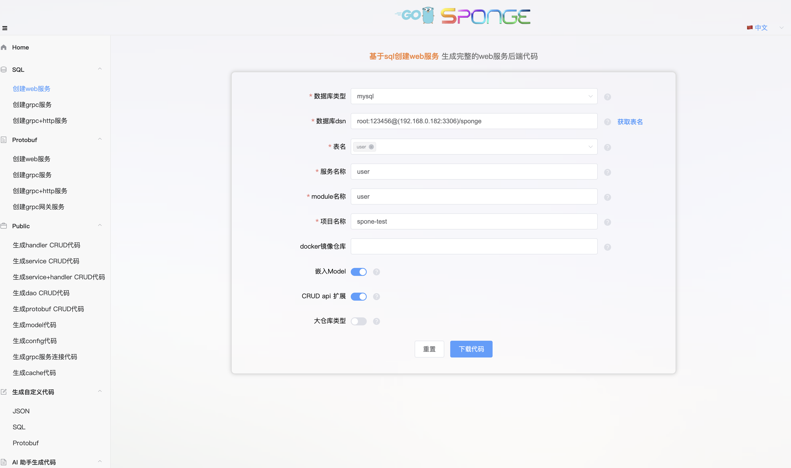

**sponge 是一个强大且易用的 Go 开发框架，其核心理念是定义即代码(Definition is Code)，通过解析 SQL、Protobuf、JSON 文件逆向生成模块化的 Go 代码，这些模块代码可灵活组合成多种类型的完整后端服务。**

**sponge 提供一站式项目开发解决方案，涵盖代码生成、开发、测试、API 文档和部署等，帮助开发者以"低代码"方式轻松构建稳定可靠的高性能后端服务(包括 RESTful API、gRPC、HTTP+gRPC、gRPC Gateway 等)，大幅提升项目开发的效率与质量。**

**适用场景**

sponge 适用于快速构建多种类型的高性能后端服务，适用场景如下：

- **开发 RESTful API 服务**
- **构建微服务项目**
- **云原生开发**
- **快速重构旧有项目**
- **作为 Go 初学者或团队学习 Go 项目结构和最佳实践的起点**

此外，开发者还可以通过自定义模板，生成满足业务需求的各类代码。

### 主要功能

1. **一键生成完整后端服务代码**
   对于仅需 `CRUD API` 的 `Web`、`gRPC`或`HTTP+gRPC`服务，无需编写任何 `Go` 代码。只需连接数据库(如 `MySQL`、`MongoDB`、`PostgreSQL`、`SQLite`)，即可一键生成完整后端服务代码，并轻松部署到 Linux 服务器、Docker 或 Kubernetes 上。

2. **高效开发通用服务**
   开发通用的 `Web`、`gRPC`、`HTTP+gRPC` 或 `gRPC Gateway` 服务，只需专注于以下三部分：

   - 数据库表的定义；
   - 在 Protobuf 文件中定义 API 描述信息；
   - 在生成的模板中，使用内置 AI 助手或人工编写业务逻辑代码。

   服务的框架代码和 CRUD API 代码均由 sponge 自动生成。

3. **支持自定义模板，灵活扩展**
   sponge 支持通过自定义模板生成项目所需的多种代码类型，不局限于 `Go` 语言。例如`后端代码`、`前端代码`、`测试代码`、`构建和部署脚本`等。

4. **在页面生成代码，简单易用**
   sponge 提供在页面生成代码，避免了复杂的命令行操作，只需在页面上简单的填写参数即可一键生成代码。

5. **sponge 与 AI 助手协同开发，形成开发闭环**
   sponge 与 内置的 AI 助手(DeepSeek、ChatGPT、Gemini) 结合形成一套完整的高效开发解决方案：

   - **sponge**：负责基础设施代码生成，包括`服务框架`、`CRUD API`、`自定义 API(缺少业务逻辑)`等代码。
   - **AI 助手**：专注业务逻辑实现，包括`表结构 DDL 设计`、`自定义 API 设计`、`业务逻辑`等代码。

### 快速开始

1. **docker compose 安装 sponge**

```yaml
version: "3.7"
services:
  sponge:
    image: zhufuyi/sponge:latest
    container_name: sponge
    restart: always
    command: ["-a", "http://192.168.0.182:24631"]
    ports:
      - "24631:24631"
```

2. 在本地浏览器访问 `http://localhost:24631`，在页面上操作生成代码，如下图所示：


