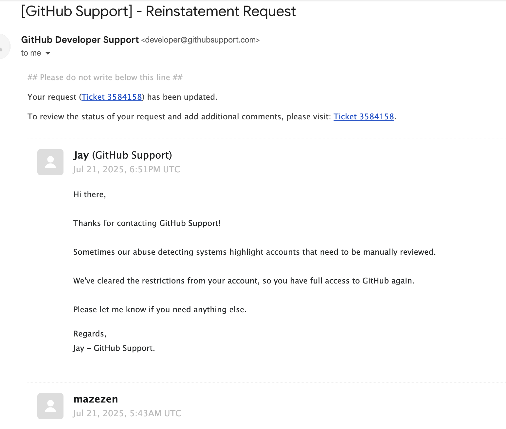

## 起因

> 我的 github 账号用了好几年了。 在上面会开源一些自己写的代码，和学习的代码。 包括自己的博客，也是用的 github page 搭建的。
> 在一个周末写博客提交之后发现没有触发 action. 访问自己的博客发现也访问不了。 进入 github 主页头部提示一条消息 “Your account has been falgged”
> 怀疑是频繁 IP 变动导致的.

## 有什么影响呢

- 我还能登陆. 我的代码仓库还在
- 别人搜不到你的 github 账号
- 别人看不到你的代码仓库

## 联系 github

> 尝试了各种自救的方法,发现无效后.开始尝试联系 github 支持.
> 我在联系 github 支持填写工单的时候, 需要手机号验证码.由于某些原
> 因. 国内的手机号是不在支持的国家和地区中的. 于是使用虚拟接码平台接收验证码.
> 这里要特别注意: 如果验证码接收不到, 换一个手机号重新接收,需要等待 24 小时,
> github 会限流. 在我等待中尝试了 N 次之后,终于接收到了验证码.并填写了工单.

我用的是 sms-activate 接受的验证码. 服务选择的是 `Google,youtube,Gmail`.尽量选择贵一点的号,不然接收不到验证码. 我买的是 1.6$的.

## 工单

```text
Dear Sir/Madam
I have been a GitHub user for several years now and have never encountered any issues I remember to use GitHub according to the specifications, and I really like it In these years, I have written some code myself and open sourced it here My personal blog mazezen.github.io is also implemented through the GitHub page. Now my account has suddenly been flagged. Others are unable to view my account May I ask what I should do to recover. I am very grateful for your help
```

填写工单的时候,正好赶上 github 工单暂停服务. 本以为需要等到 27 号之后,才会受到回复.没想到是差不多 24 小时不到,就收到了 github 的回复,并表示已经恢复了账号的使用



