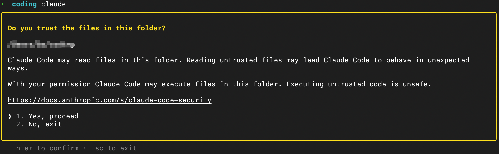

使用 AI 这么久了, 用了很多AI, AI Agent, Skills, 时间一久, 用了哪些, 有什么作用, 如何使用的, 就容易忘记, 毕竟AI更新太快了.
俗话说, 好记性比如烂笔头, 记录下来, 以防自己忘记的时候, 可以查阅.

目前 AI 代理工具太多了, 使用 OpenClaw, Codex, ClaudeCode, Freebuff, 包括ollama等等

目前还在使用的有 CluadeCode, Freebuff. Aider. 都记录下, 使用哪个都可以.

## 一 FreeBuff 是 CodeBuff 的魔改版(也就是免费版).

`FreeBuff` 目前主要对接的是 `DeepSeek`大模型, 听名字就能听出来, 是免费的. 主要靠广告位挣钱. 启动之后对话框上方的是广告位. 用着是能用, 但是不是那么好用. 比如对话框输入时文字,输入法的位置是乱的, 无法对接其他大模型(但是可以通过`/connect` 链接 `ChatGPT`), 选择不同的模型的时候, 不太灵敏, 不支持自定义SKILLS,  但是是免费的, 已经很香了.

`CodeBuff` 是开源的. `CodeBuff`支持定义`Skills和MCP`. 开源在 <a href="https://github.com/CodebuffAI/codebuff"> github</a>上

安装 `FreeBuff` 得有 `Node` 环境. <a href="https://freebuff.com/"> FreeBuff官网</a>

安装命令

```bash
npm install -g freebuff
```

启动: 选择一个目录启动.启动只是,按下 `Enter`键 进行对话框

```bash
freebuff
```

命令:

```bash
/help                 # Display keyboard shortcuts and tips
/connect              # Connect your ChatGPT account
/interview            # AI asks a series of quesitons to flesh out request into a spec
/plan                 # Connect required. Create a plan with GPT 5.4
/review               # Connect required. Review code changes with GPT5.4
/new                  # Clear the conversation history and start a new chat
/history              # Browase and resume past conversations
/feedback             # Share general feedback about Freebuff
/bash                 # Enter bash mode ("!" at beigining enters bash mode)
/theme:toggle         # Toggle between light and dark node
/end-session          # End your free session (lets you switch model)
/logout               # Sign out of your session
/exit                 # Quit the CLI
```

在对话过程总, 使用 `Ctrl+c`, 可以终止对话,再按一次既可退出.


## 二 Claude + LiteLLM

ClaudeCode 生态好, 也是目前最火的AI 代理工具, 各种教程,SKILLS等等也是更新比较快的, 用的不在于多, 而是把一个工具训练成适合自己的.

Claude 分为桌面版`Claude`可从<a href="https://claude.com/">官网</a>下载, 和`ClaudeCode` CLI版, 目前这两个都在用, 比较常用的还是

CLI版本. <a href="https://claude.com/product/claude-code">`ClaudeCode` 下载地址</a>. 因为我是`Mac` 用户, 也可以使用命令下载.

```bash
brew install --cask claude-code
```

**使用**

1. 打开终端输入 `claude`, 既可启动 `ClaudeCode` CLI. 但是吧,得充钱, 不充钱 用不了😄. 但是吧, 可以绕开.

安装完之后在 `$HOME/.claude.json` 文件, 可以通过修改这个文件, 来绕开必须登录才能使用的限制.

```bash
# 编辑 claude.json
vim $HOME/.claude.json

# 添加以下配置
{
  "hasCompletedOnboarding": true
}

```

**启动**, 就完成了不需要登录了. 虽然绕开了, 但是没有 API KEY 还是无法使用.

```bash
claude
```



那就购买😄或者对接其他大模型, 只使用他这个`AI代理壳子`.因为 Claude Code 原生使用的是 Anthropic API 格式，要对接其他模型，你需要在中间架设一层支持该格式转换的适配器/网关.

Github 有很多开源的一键对接脚本.

如 <a href="https://github.com/BerriAI/litellm">LiteLLM</a> 支持`100+大模型`, 也是目前最成熟、最稳定的API代理方案， 支持一键 Docker 部署。


下载运行

```bash
https://github.com/mazezen/litellm
```

访问 http://localhost:8000/ui/login 登录 控制面板. 可以在里面查看配置的模型及使用情况等等.


### **使用**

```bash
# 一键部署
cd litellm
docker compose up -d

# 查看日志
docker compose logs -f

# 验证是否启动成功
curl http://localhost:8000/health

# 停止（数据仍在）
docker compose down

# 完全删除（不留任何数据）
docker compose down --rmi al5. Claude Code 配置
```

**映射. 为什么要用 Claude 的模型名作为假名？**

因为 Claude Code 客户端只认识 Claude 自己的模型名，用 `deepseek/deepseek-chat` 它会报错。所以用 LiteLLM 做中间层，对外假装是 Claude 模型，实际转发给 DeepSeek / Gemini。

| 别名                  | config.yaml 的 model_name（假名） | 实际调用的模型                    |
| --------------------- | --------------------------------- | --------------------------------- |
| `claude-v4-flash`     | `claude-sonnet-4-20250514`        | `deepseek/deepseek-v4-flash`      |
| `claude-v4-pro`       | `claude-opus-4-20250514`          | `deepseek/deepseek-v4-pro`        |
| `claude-deepseek`     | `claude-3-5-sonnet-20241022`      | `deepseek/deepseek-chat` (V3)     |
| `claude-r1`           | `claude-3-opus-20240229`          | `deepseek/deepseek-reasoner` (R1) |
| `claude-gemini-flash` | `claude-3-5-haiku-20241022`       | `gemini/gemini-2.5-flash`         |
| `claude-gemini-pro`   | `claude-3-haiku-20240307`         | `gemini/gemini-2.5-pro`           |


在 `.zshrc` 里设置别名，一键切换：

```bash
# DeepSeek V4 Flash
alias claude-v4-flash='ANTHROPIC_BASE_URL=http://localhost:8000 ANTHROPIC_API_KEY=sk-1234  ANTHROPIC_MODEL=claude-sonnet-4-20250514 claude'

# DeepSeek V4 Pro
alias claude-v4-pro='ANTHROPIC_BASE_URL=http://localhost:8000 ANTHROPIC_API_KEY=sk-1234 ANTHROPIC_MODEL=claude-opus-4-20250514 claude'

# DeepSeek V3（日常写代码主力）
alias claude-deepseek='ANTHROPIC_BASE_URL=http://localhost:8000 ANTHROPIC_API_KEY=sk-1234 ANTHROPIC_MODEL=claude-3-5-sonnet-20241022 claude'

# DeepSeek R1（复杂推理）
alias claude-r1='ANTHROPIC_BASE_URL=http://localhost:8000 ANTHROPIC_API_KEY=sk-1234 ANTHROPIC_MODEL=claude-3-opus-20240229 claude'

# Gemini 2.5 Flash（免费不限量）
alias claude-gemini-flash='ANTHROPIC_BASE_URL=http://localhost:8000 ANTHROPIC_API_KEY=sk-1234 ANTHROPIC_MODEL=claude-3-5-haiku-20241022 claude'

# Gemini 2.5 Pro（每天50次免费）
alias claude-gemini-pro='ANTHROPIC_BASE_URL=http://localhost:8000 ANTHROPIC_API_KEY=sk-1234 ANTHROPIC_MODEL=claude-3-haiku-20240307 claude'
```


| 别名                  | 启动命令                                                     | 实际模型          | 适用场景               |
| --------------------- | ------------------------------------------------------------ | ----------------- | ---------------------- |
| `claude-v4-flash`     | `ANTHROPIC_BASE_URL=http://localhost:8000 ANTHROPIC_MODEL=claude-sonnet-4-20250514 claude` | DeepSeek V4 Flash | 快速响应               |
| `claude-v4-pro`       | `ANTHROPIC_BASE_URL=http://localhost:8000 ANTHROPIC_MODEL=claude-opus-4-20250514 claude` | DeepSeek V4 Pro   | 高质量输出             |
| `claude-deepseek`     | `ANTHROPIC_BASE_URL=http://localhost:8000 ANTHROPIC_MODEL=claude-3-5-sonnet-20241022 claude` | DeepSeek V3       | 日常写代码主力         |
| `claude-r1`           | `ANTHROPIC_BASE_URL=http://localhost:8000 ANTHROPIC_MODEL=claude-3-opus-20240229 claude` | DeepSeek R1       | 复杂推理任务           |
| `claude-gemini-flash` | `ANTHROPIC_BASE_URL=http://localhost:8000 ANTHROPIC_MODEL=claude-3-5-haiku-20241022 claude` | Gemini 2.5 Flash  | 免费无限量             |
| `claude-gemini-pro`   | `ANTHROPIC_BASE_URL=http://localhost:8000 ANTHROPIC_MODEL=claude-3-haiku-20240307 claude` | Gemini 2.5 Pro    | 免费每天50次，质量更高 |

以下是 Claude Code 常用命令：

### 斜杠命令（在对话框里输入）

| 命令                | 说明                                |
| ------------------- | ----------------------------------- |
| `/help`             | 查看所有命令                        |
| `/status`           | 查看当前配置（model、base url等）   |
| `/init`             | 在当前项目生成 `CLAUDE.md` 配置文件 |
| `/clear`            | 清空当前对话上下文                  |
| `/compact`          | 压缩上下文（节省 token）            |
| `/cost`             | 查看本次会话花费的 token 和费用     |
| `/model`            | 切换模型                            |
| `/terminal-setup`   | 配置终端快捷键                      |
| `/login`            | 重新登录                            |
| `/logout`           | 退出登录                            |
| `/bug`              | 提交 bug 反馈                       |
| `/exit` 或 `Ctrl+C` | 退出                                |

### 启动参数（命令行）

| 命令                                    | 说明                       |
| --------------------------------------- | -------------------------- |
| `claude`                                | 启动交互模式               |
| `claude "帮我写一个排序函数"`           | 直接带问题启动             |
| `claude -p "你的问题"`                  | 非交互模式，输出结果后退出 |
| `claude --continue`                     | 继续上一次会话             |
| `claude --resume`                       | 选择历史会话恢复           |
| `claude --dangerously-skip-permissions` | 跳过所有操作确认（慎用）   |

### 快捷键

| 快捷键    | 说明           |
| --------- | -------------- |
| `Esc`     | 打断当前输出   |
| `Esc Esc` | 编辑上一条消息 |
| `Ctrl+C`  | 退出           |
| `↑`       | 查看历史输入   |

### 常用工作流

bash

```bash
# 进入项目目录，初始化
cd your-project
claude-deepseek
/init

# 让它读代码然后提问
> 帮我分析这个项目的结构

# 直接让它改代码
> 把 src/api.js 里的回调改成 async/await

# 查看花了多少钱
/cost
```


## 三 Aider

1. 可以保存历史记录(~/.aider.chat.history.md), 相当于之前的历史对话问题, 也是可以调出来的.
2. 支持 `/model` 切换模型, 这样可以更好的使用 主备模型来切换. 既可以提高效率, 还可以节省 `Token`成本.

```bash
brew install aider
```

### 配置 API Key（~/.zshrc）

编辑 `~/.zshrc`，填入你的 API Key，这样每次打开终端自动生效：

```bash
# ~/.zshrc

# DeepSeek（付费，白菜价）
export DEEPSEEK_API_KEY="sk-your-deepseek-key"

# Google Gemini（免费）
export GEMINI_API_KEY="your-gemini-key"

# OpenAI（可选）
export OPENAI_API_KEY="sk-your-openai-key"
```

重载配置：

```bash
source ~/.zshrc
```

### 启动

配置好 API Key 后，直接启动即可：

```bash
aider --model deepseek --api-key deepseek=$DEEPSEEK_API_KEY
```

如果想用 Gemini（免费）：

```bash
aider --model gemini/gemini-2.5-flash --api-key gemini=$GEMINI_API_KEY
```

### 对话中切换模型

启动后，使用 `/model` 命令随时切换：

```
/model deepseek              # 切回 DeepSeek V3（日常写代码）
/model gemini/gemini-2.5-flash   # 切到 Gemini（免费）
/model deepseek-reasoner     # 切到 DeepSeek R1（复杂推理）
```

一条命令清除所有 Aider 数据

```bash
rm -rf ~/.aider/ ~/.aider.conf.yml ~/.aider.input.history
find . -name '.aider*' -exec rm -f {} + 2>/dev/null
```

| 删什么           | 位置                        |
| ---------------- | --------------------------- |
| API Key 和配置   | ~/.aider.conf.yml           |
| 输入历史         | ~/.aider.input.history      |
| 缓存/其他数据    | ~/.aider/ 目录              |
| 项目里的对话历史 | 当前目录下所有 .aider* 文件 |

目前在使用的模型有

| 模型                  | Aider 调用名                     | 额度                       | 场景              |
| --------------------- | -------------------------------- | -------------------------- | ----------------- |
| **deepseek-v4-flash** | deepseek/deepseek-v4-flash       | 💰 付费                     | 快速对话/高性价比   |
| **deepseek-v4-pro**   | deepseek/deepseek-v4-pro         | 💰 付费                     | 复杂推理/高精度     |
| **deepseek-v3**       | deepseek 或 deepseek-chat        | 💰 付费 (约 $0.14/M token) | 日常写代码 🏆      |
| **deepseek-r1**       | deepseek-reasoner                | 💰 付费 (约 $0.14/M token) | 复杂推理/数学/逻辑 |
| **Gemini 2.5 Flash**  | gemini/gemini-2.5-flash          | ✅ 完全免费，无上限          | 日常写代码 🏆      |
| **Gemini 2.5 Pro**    | gemini/gemini-2.5-pro            | ✅ 免费 50次/天              | 复杂任务备用       |

## Aider 常用命令

```bash
/help                  # 显示帮助信息
/model <name>          # 切换模型
/commit                # 提交当前代码到 Git
/diff                  # 显示修改差异
/undo                  # 撤销上一次 AI 修改
/drop                  # 清除当前对话历史（保留 Git 提交）
/clear                 # 清屏
/tokens                # 查看当前会话 token 用量
/read-only             # 添加只读文件到上下文
/git                   # 执行自定义 Git 命令
/copy                  # 复制上次代码修改到剪贴板
/lint                  # 运行 linter 检查代码
/quit 或 /exit         # 退出 Aider
```

## /model 切换命令

```bash
/model deepseek              # DeepSeek V3（日常写代码）
/model deepseek-reasoner     # DeepSeek R1（复杂推理）
/model deepseek/deepseek-v4-flash   # DeepSeek V4 Flash（快速对话）
/model deepseek/deepseek-v4-pro     # DeepSeek V4 Pro（高精度）
/model gemini/gemini-2.5-flash      # Gemini 2.5 Flash（免费）
/model gemini/gemini-2.5-pro        # Gemini 2.5 Pro（付费/免费额度）
/model openai/gpt-4o                # OpenAI GPT-4o
/model openai/gpt-4o-mini           # OpenAI GPT-4o mini
/list-models                        # 查看所有可用模型
```


## 四 Idea

个人比较喜欢 CLI AI, 或者 TUI. 很多人喜欢在编辑器里使用 AI, 个人不太喜欢. 不想手写代码, 就使用CLI 让AI 帮你写, 减轻工作量. 想自己写了就打开 IDEA自己写, 锻炼自己的编程能力. 而且IDEA里面嵌入AI, 会导致 IDEA过于臃肿.


### Vscode 禁用全局内置 AI 功能 

VS Code 提供了统一的开关，可一键禁用所有内置 AI 功能（包括 AI 聊天和代码建议）。

- 使用快捷键 `Ctrl + ,`（Windows/Linux）或 `Cmd + ,`（Mac）打开设置。
- 在搜索框中输入 `chat.disableAIFeatures`。
- 找到 **Chat: Disable AI Features** 选项，并勾选启用它。

